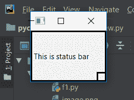

# pyqt 5–设置状态栏的最小宽度/高度

> 原文:[https://www . geeksforgeeks . org/pyqt 5-set-最小长度-宽度-高度-状态栏/](https://www.geeksforgeeks.org/pyqt5-set-minimum-length-for-width-height-of-status-bar/)

当我们创建状态栏时，默认情况下，状态栏的大小是可调整的。虽然我们可以使用带有状态栏的`setMinimumSize()`方法来设置状态栏的最小尺寸，但是如果我们只想为宽度或高度设置最小长度呢？
为了做到这一点，所以我们使用带有状态栏的`setMinimumWidth()`方法来设置最小宽度，使用带有状态栏的`setMinimumHeight()`方法来设置最小高度，当我们使用这些方法时，其他长度将是可变的，即没有最小长度，它可以尽可能地收缩。

> **语法:**
> 
> ```
> self.statusBar().setMinimumWidth(width)
> self.statusBar().setMinimumHeight(height)
> 
> ```
> 
> **自变量:**
> 二者均以整数为自变量。
> 
> **执行的动作:**
> `setMinimumWidth()`设置最小宽度。
> `setMinimumHeight()`设置最小高度。

**代码:**

```
from PyQt5.QtCore import * 
from PyQt5.QtGui import * 
from PyQt5.QtWidgets import *
import sys

class Window(QMainWindow):
    def __init__(self):
        super().__init__()

        # set the title
        self.setWindowTitle("Python")

        # setting  the geometry of window
        self.setGeometry(60, 60, 600, 400)

        # setting status bar message
        self.statusBar().showMessage("This is status bar")

        # setting  border
        self.statusBar().setStyleSheet("border :3px solid black;")

        # setting minimum Height of status bar
        self.statusBar().setMinimumHeight(100)

        # creating a label widget
        self.label_1 = QLabel("status bar", self)

        # moving position
        self.label_1.move(100, 100)

        # setting up the border
        self.label_1.setStyleSheet("border :1px solid blue;")

        # resizing label
        self.label_1.adjustSize()

        # show all the widgets
        self.show()

# create pyqt5 app
App = QApplication(sys.argv)

# create the instance of our Window
window = Window()

# start the app
sys.exit(App.exec())
```

**输出:**

