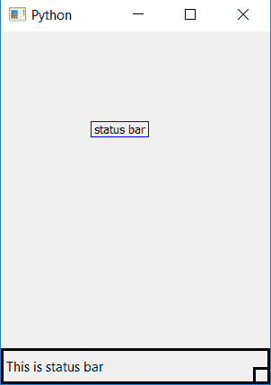

# PyQt5–设置状态栏的最小尺寸

> 原文:[https://www . geeksforgeeks . org/pyqt 5-set-最小尺寸状态栏/](https://www.geeksforgeeks.org/pyqt5-set-minimum-size-of-status-bar/)

我们知道我们可以调整 PyQt5 应用程序的窗口大小，但是当我们调整窗口大小时，状态栏也会根据窗口的大小调整大小。缩小窗口时，我们可以设置最小尺寸，这样状态栏就不会再缩小了。在本文中，我们将看到如何做到这一点，为了做到这一点，我们将使用 setMinimumSize()方法。

> **语法:** self.statusBar()。setMinimumSize(宽度、高度)
> 
> **自变量:**取两个整数作为自变量，即宽度和高度。
> 
> **执行的操作:**设置状态栏的最小尺寸。

**代码:**

```py
from PyQt5.QtCore import * 
from PyQt5.QtGui import * 
from PyQt5.QtWidgets import * 
import sys

class Window(QMainWindow):
    def __init__(self):
        super().__init__()

        # set the title
        self.setWindowTitle("Python")

        # setting  the geometry of window
        self.setGeometry(60, 60, 600, 400)

        # setting status bar message
        self.statusBar().showMessage("This is status bar")

        # setting  border
        self.statusBar().setStyleSheet("border :3px solid black;")

        # setting minimum size of status bar
        self.statusBar().setMinimumSize(300, 40)

        # creating a label widget
        self.label_1 = QLabel("status bar", self)

        # moving position
        self.label_1.move(100, 100)

        # setting up the border
        self.label_1.setStyleSheet("border :1px solid blue;")

        # resizing label
        self.label_1.adjustSize()

        # show all the widgets
        self.show()

# create pyqt5 app
App = QApplication(sys.argv)

# create the instance of our Window
window = Window()

# start the app
sys.exit(App.exec())
```

**输出:**
