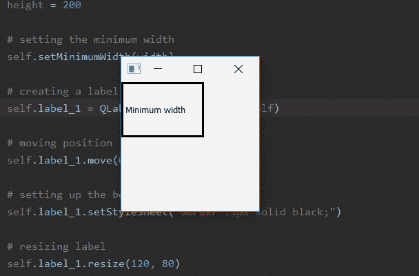
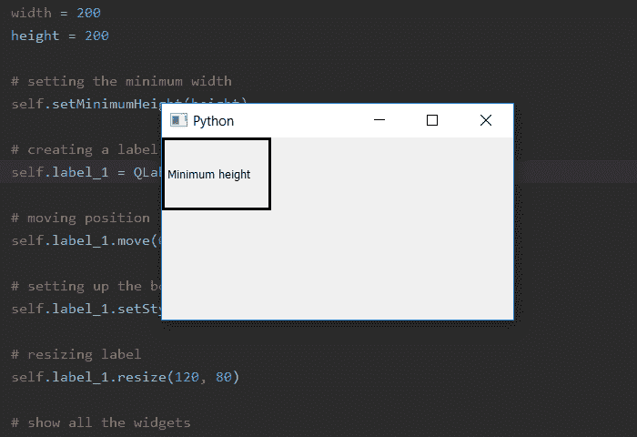

# PyQt5–设置最小窗口大小|设置最小宽度和设置最小高度方法

> 原文:[https://www . geesforgeks . org/pyqt 5-set-minimum-window-size-setminimum-width-and-setminimum-height-method/](https://www.geeksforgeeks.org/pyqt5-set-minimum-window-size-setminimumwidth-and-setminimumheight-method/)

当我们创建一个窗口时，默认情况下窗口大小是可调整的，尽管我们可以使用 setMinimumSize()方法来设置窗口的最小大小。但是如果我们只想为宽度或高度设置最小长度怎么办，为此我们使用`setMinimumWidth()`方法设置最小宽度，使用`setMinimumHeight()`方法设置最小高度。当我们使用这些方法时，其他长度将是可变的，即没有最小长度，它可以尽可能地收缩。

> **语法:**
> 
> ```py
> self.setMinimumWidth(width)
> self.setMinimumHeight(height)
> 
> ```
> 
> **自变量:**两者均以整数为自变量。
> 
> **行动执行完毕。**
> `setMinimumWidth()`设置最小宽度。
> `setMinimumHeight()`设置最小高度。

**最小宽度设置代码:**

```py
# importing the required libraries

from PyQt5.QtCore import * 
from PyQt5.QtGui import * 
from PyQt5.QtWidgets import * 
import sys

class Window(QMainWindow):
    def __init__(self):
        super().__init__()

        # set the title
        self.setWindowTitle("Python")

        width = 200
        height = 200

        # setting the minimum width
        self.setMinimumWidth(width)

        # creating a label widget
        self.label_1 = QLabel("Minimum width", self)

        # moving position
        self.label_1.move(0, 0)

        # setting up the border
        self.label_1.setStyleSheet("border :3px solid black;")

        # resizing label
        self.label_1.resize(120, 80)

        # show all the widgets
        self.show()

# create pyqt5 app
App = QApplication(sys.argv)

# create the instance of our Window
window = Window()

# start the app
sys.exit(App.exec())
```

**输出:**


**最小宽度设置代码:**

```py
# importing the required libraries

from PyQt5.QtCore import * 
from PyQt5.QtGui import * 
from PyQt5.QtWidgets import * 
import sys

class Window(QMainWindow):
    def __init__(self):
        super().__init__()

        # set the title
        self.setWindowTitle("Python")

        width = 200
        height = 200

        # setting the minimum width
        self.setMinimumHeight(height)

        # creating a label widget
        self.label_1 = QLabel("Minimum height", self)

        # moving position
        self.label_1.move(0, 0)

        # setting up the border
        self.label_1.setStyleSheet("border :3px solid black;")

        # resizing label
        self.label_1.resize(120, 80)

        # show all the widgets
        self.show()

# create pyqt5 app
App = QApplication(sys.argv)

# create the instance of our Window
window = Window()

# start the app
sys.exit(App.exec())
```

**输出:**
