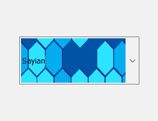
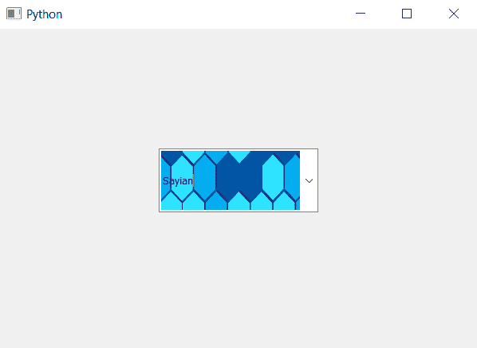

# PyQt5–将皮肤设置为组合框的线编辑部分

> 原文:[https://www . geeksforgeeks . org/pyqt 5-设置-皮肤到线-编辑-组合框的一部分/](https://www.geeksforgeeks.org/pyqt5-set-skin-to-line-edit-part-of-combobox/)

在本文中，我们将看到如何设置组合框的线条编辑部分，线条编辑是用来输入和查看项目的部分。皮肤基本上是背景图像，它根据线条编辑的大小来调整自己，下面是皮肤到线条编辑部分的样子



**这样做的步骤:**
1。创建组合框
2。创建一个 QLineEdit 对象
3。将皮肤设置为 QlineEdit 对象
4。将 QLineEdit 对象添加到组合框中

**语法:**

```py
# creating line edit object
line_edit = QLineEdit()

# setting skin to line edit
line_edit.setStyleSheet("QLineEdit"
                        "{"
                        "border-image : url(skin.png);"
                        "}")

# adding line edit object to combo box
combo_box.setLineEdit(line_edit)

```

下面是实现

```py
# importing libraries
from PyQt5.QtWidgets import * 
from PyQt5 import QtCore, QtGui
from PyQt5.QtGui import * 
from PyQt5.QtCore import * 
import sys

class Window(QMainWindow):

    def __init__(self):
        super().__init__()

        # setting title
        self.setWindowTitle("Python ")

        # setting geometry
        self.setGeometry(100, 100, 600, 400)

        # calling method
        self.UiComponents()

        # showing all the widgets
        self.show()

    # method for widgets
    def UiComponents(self):
        # creating a check-able combo box object
        self.combo_box = QComboBox(self)

        # setting geometry of combo box
        self.combo_box.setGeometry(200, 150, 200, 80)

        # making combo box editable
        self.combo_box.setEditable(True)

        # geek list
        geek_list = ["Sayian", "Super Sayian", "Super Sayian 2", "Super Sayian B"]

        # adding list of items to combo box
        self.combo_box.addItems(geek_list)

        # creating line edit object
        line_edit = QLineEdit()

        # setting skin to line edit
        line_edit.setStyleSheet("QLineEdit"
                                "{"
                                "border-image : url(skin.png);"
                                "}")

        # adding line edit object to combo box
        self.combo_box.setLineEdit(line_edit)

# create pyqt5 app
App = QApplication(sys.argv)

# create the instance of our Window
window = Window()

window.show()

# start the app
sys.exit(App.exec())
```

**输出:** 