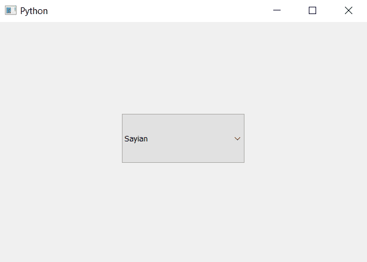

# pyqt 5–在开启状态下将皮肤设置为不可编辑的组合框

> 原文:[https://www . geesforgeks . org/pyqt 5-设置-皮肤-不可编辑-状态时组合框/](https://www.geeksforgeeks.org/pyqt5-set-skin-to-non-editable-combobox-when-in-on-state/)

在本文中，我们将看到如何在不可编辑的组合框处于打开状态时为其设置外观。皮肤基本上是背景图像，但皮肤根据组合框的大小调整其大小。ON 状态是当列表视图(项目视图)打开时，使用`setEditable`方法使组合框可编辑。只有当组合框不可编辑且处于打开状态时，皮肤才会出现

为此，我们必须更改组合框的样式表代码，下面是样式表代码

```py
QComboBox::!editable:on
{
border-image : url(image.png);
}

```

下面是实现

```py
# importing libraries
from PyQt5.QtWidgets import * 
from PyQt5 import QtCore, QtGui
from PyQt5.QtGui import * 
from PyQt5.QtCore import * 
import sys

class Window(QMainWindow):

    def __init__(self):
        super().__init__()

        # setting title
        self.setWindowTitle("Python ")

        # setting geometry
        self.setGeometry(100, 100, 600, 400)

        # calling method
        self.UiComponents()

        # showing all the widgets
        self.show()

    # method for widgets
    def UiComponents(self):
        # creating a check-able combo box object
        self.combo_box = QComboBox(self)

        # setting geometry of combo box
        self.combo_box.setGeometry(200, 150, 200, 80)

        # making combo box editable
        # self.combo_box.setEditable(True)

        # geek list
        geek_list = ["Sayian", "Super Sayian", "Super Sayian 2", "Super Sayian B"]

        # adding list of items to combo box
        self.combo_box.addItems(geek_list)

        # setting style sheet of combo box
        # adding skin to the combo box when it is non-editable
        # and when it in on state
        self.combo_box.setStyleSheet("QComboBox::! editable:on"
                                     "{"
                                     "border-image : url(image.png);"
                                     "border : 1px solid black;"
                                     "}")

# create pyqt5 app
App = QApplication(sys.argv)

# create the instance of our Window
window = Window()

window.show()

# start the app
sys.exit(App.exec())
```

**输出:**


当列表视图打开时

