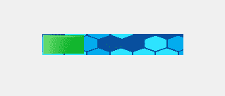
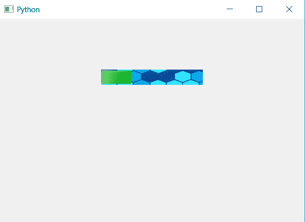

# PyQt5–将皮肤设置为进度条

> 原文:[https://www . geeksforgeeks . org/pyqt 5-set-skin-to-progress-bar/](https://www.geeksforgeeks.org/pyqt5-set-skin-to-progress-bar/)

在本文中，我们将看到如何设置进度条的皮肤。皮肤基本上是一个背景图像，但它会根据进度条的大小自行调整。下面是带有背景图像的进度条和带有皮肤的进度条。

 

为了做到这一点，我们必须改变与`setStyleSheet`方法一起使用的 CSS 样式表代码，下面是样式表代码。

```py
QProgressBar
{
border :1px solid black;
border-image : url(skin.png);
}

```

下面是实现。

```py
# importing libraries
from PyQt5.QtWidgets import * 
from PyQt5 import QtCore, QtGui
from PyQt5.QtGui import * 
from PyQt5.QtCore import * 
import sys

class Window(QMainWindow):

    def __init__(self):
        super().__init__()

        # setting title
        self.setWindowTitle("Python ")

        # setting background color to window
        # self.setStyleSheet("background-color : yellow")

        # setting geometry
        self.setGeometry(100, 100, 600, 400)

        # calling method
        self.UiComponents()

        # showing all the widgets
        self.show()

    # method for widgets
    def UiComponents(self):
        # creating progress bar
        bar = QProgressBar(self)

        # setting geometry to progress bar
        bar.setGeometry(200, 100, 200, 30)

        # setting the value
        value = 30
        bar.setValue(value)

        # setting alignment to center
        bar.setAlignment(Qt.AlignCenter)

        # setting skin to progress bar
        bar.setStyleSheet("QProgressBar "
                          "{"
                          "border : 1px solid black;"
                          "border-image : url(skin.png);"
                          "}"
                          )

App = QApplication(sys.argv)

# create the instance of our Window
window = Window()

# start the app
sys.exit(App.exec())
```

**输出:**
