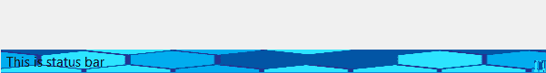
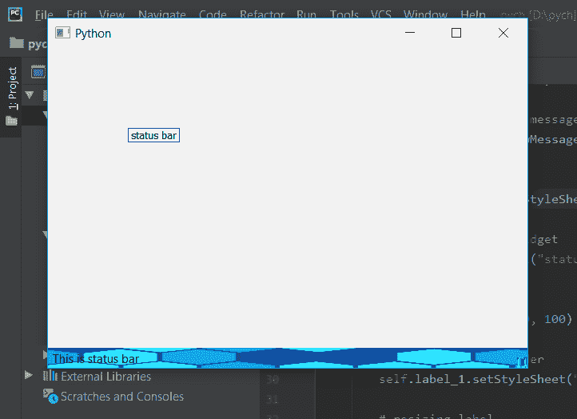

# PyQt5–将皮肤设置为状态栏

> 原文:[https://www.geeksforgeeks.org/pyqt5-set-skin-to-status-bar/](https://www.geeksforgeeks.org/pyqt5-set-skin-to-status-bar/)

与设置背景图像不同，皮肤根据状态栏的大小自行调整。在背景图像中，如果图像尺寸较大，而状态栏尺寸较小，则只有包含状态栏尺寸的图像部分是可显示的。将皮肤设置为状态栏的主要原因是，状态栏的高度相对小于正常图像，这就是为什么不使用背景图像皮肤更可取的原因。

背景和皮肤会是这样的:




> **语法:** self.statusBar()。set 样式表(“边框图像:URL(skin . png)；”)
> 
> **自变量:**它以字符串为自变量。
> 
> **执行的操作:**将皮肤设置为状态栏。

**代码:**

```py
from PyQt5.QtCore import * 
from PyQt5.QtGui import * 
from PyQt5.QtWidgets import * 
import sys

class Window(QMainWindow):
    def __init__(self):
        super().__init__()

        # set the title
        self.setWindowTitle("Python")

        # setting  the geometry of window
        self.setGeometry(60, 60, 600, 400)

        # setting status bar message
        self.statusBar().showMessage("This is status bar")

        # setting  skin to status bar
        self.statusBar().setStyleSheet("border-image : url(skin.png);")

        # creating a label widget
        self.label_1 = QLabel("status bar", self)

        # moving position
        self.label_1.move(100, 100)

        # setting up the border
        self.label_1.setStyleSheet("border :1px solid blue;")

        # resizing label
        self.label_1.adjustSize()

        # show all the widgets
        self.show()

# create pyqt5 app
App = QApplication(sys.argv)

# create the instance of our Window
window = Window()

# start the app
sys.exit(App.exec())
```

**输出:**
