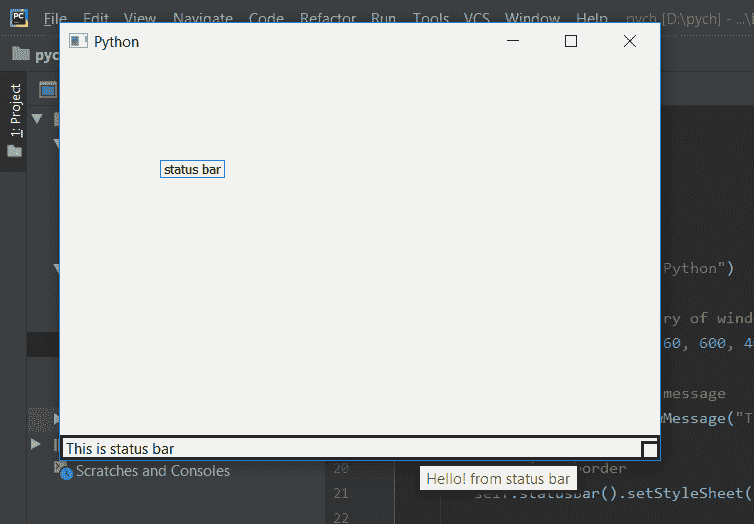

# PyQt5–将刀尖持续时间设置到状态栏

> 原文:[https://www . geesforgeks . org/pyqt 5-set-tool-tip-duration-to-status-bar/](https://www.geeksforgeeks.org/pyqt5-set-tool-tip-duration-to-status-bar/)

在本文中，我们将看到如何设置工具提示持续时间。我们可以使用`setToolTip`方法对状态栏对象进行工具提示，但默认情况下，工具提示不会在一段时间后自动消失。我们可以使用带有状态栏对象的`setToolTipDuration`方法来设置这个消失时间。

> **语法:** self.statusBar()。设置持续时间(毫秒)
> 
> **参数:**它以整数作为参数，表示毫秒
> 
> **执行的动作:**将持续时间设置为状态栏的工具提示。

**代码:**

```py
from PyQt5.QtCore import * 
from PyQt5.QtGui import * 
from PyQt5.QtWidgets import * 
import sys

class Window(QMainWindow):
    def __init__(self):
        super().__init__()

        # set the title
        self.setWindowTitle("Python")

        # setting  the geometry of window
        self.setGeometry(60, 60, 600, 400)

        # setting status bar message
        self.statusBar().showMessage("This is status bar")

        # setting  border
        self.statusBar().setStyleSheet("border :3px solid black;")

        # setting tool tip for status bar
        self.statusBar().setToolTip("Hello ! from status bar")

        # setting tool tip duration
        self.statusBar().setToolTipDuration(500)

        # creating a label widget
        self.label_1 = QLabel("status bar", self)

        # moving position
        self.label_1.move(100, 100)

        # setting up the border
        self.label_1.setStyleSheet("border :1px solid blue;")

        # resizing label
        self.label_1.adjustSize()

        # show all the widgets
        self.show()

# create pyqt5 app
App = QApplication(sys.argv)

# create the instance of our Window
window = Window()

# start the app
sys.exit(App.exec())
```

**输出:**

此工具提示将在 500 毫秒后即 5 秒后消失