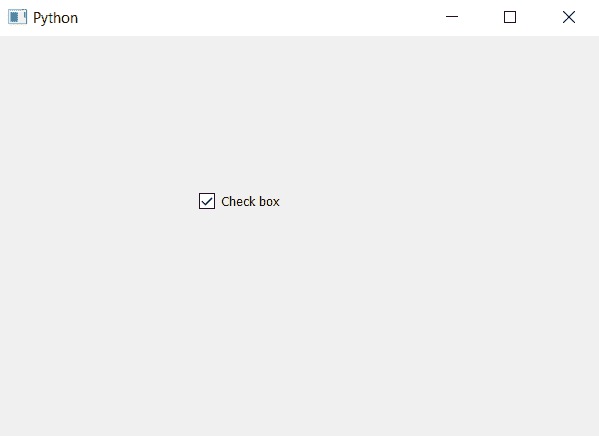

# pyqt 5–复选框

的 setChecked()方法

> 原文:[https://www . geeksforgeeks . org/pyqt 5-set checked-method-for-check-box/](https://www.geeksforgeeks.org/pyqt5-setchecked-method-for-check-box/)

`setChecked`方法用于改变复选框的状态。默认情况下，在点击复选框小部件后，它是未选中的，它的状态变为选中，但是借助`setChecked`方法，我们可以不点击它而直接进行。

> **语法:**复选框。设置选中(真)
> 
> **自变量:**它以 bool 为自变量。
> 
> **执行的动作:**将改变复选框的状态。

下面是实现。

```
# importing libraries
from PyQt5.QtWidgets import * 
from PyQt5 import QtCore, QtGui
from PyQt5.QtGui import * 
from PyQt5.QtCore import * 
import sys

class Window(QMainWindow):

    def __init__(self):
        super().__init__()

        # setting title
        self.setWindowTitle("Python ")

        # setting geometry
        self.setGeometry(100, 100, 600, 400)

        # calling method
        self.UiComponents()

        # showing all the widgets
        self.show()

    # method for widgets
    def UiComponents(self):

        # creating the check-box
        checkbox = QCheckBox('Check Box', self)

        # setting geometry of check box
        checkbox.setGeometry(200, 150, 100, 30)

        # setting check box state to checked
        checkbox.setChecked(True)

# create pyqt5 app
App = QApplication(sys.argv)

# create the instance of our Window
window = Window()

# start the app
sys.exit(App.exec())
```

**输出:**
