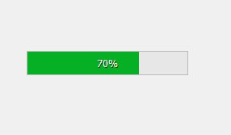
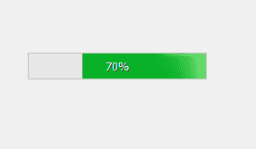
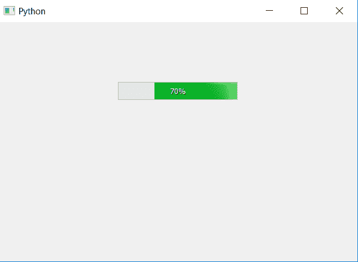

# PyQt5–设置进度条的反转显示()方法

> 原文:[https://www . geeksforgeeks . org/pyqt5-setinvertedapparance-method-for-progress-bar/](https://www.geeksforgeeks.org/pyqt5-setinvertedappearance-method-for-progress-bar/)

默认情况下，当我们在 PyQt5 中创建进度条时，进度即加载从左向右进行，但是 PyQt5 也允许我们借助`setInvertedAppearance`方法改变其方向。它以 bool 为参数，使进度条反转。

下面是普通进度条和反转进度条的外观

 

> **语法:**bar . setinvertedapparence(True)
> 
> **自变量:**它以 bool 为自变量。
> 
> **执行的动作:**将进度条设置为反转外观。

```py
# importing libraries
from PyQt5.QtWidgets import * 
from PyQt5 import QtCore, QtGui
from PyQt5.QtGui import * 
from PyQt5.QtCore import * 
import sys

class Window(QMainWindow):

    def __init__(self):
        super().__init__()

        # setting title
        self.setWindowTitle("Python ")

        # setting geometry
        self.setGeometry(100, 100, 600, 400)

        # calling method
        self.UiComponents()

        # showing all the widgets
        self.show()

    # method for widgets
    def UiComponents(self):
        # creating progress bar
        bar = QProgressBar(self)

        # setting geometry to progress bar
        bar.setGeometry(200, 100, 200, 30)

        # setting the value
        bar.setValue(70)

        # setting alignment to center
        bar.setAlignment(Qt.AlignCenter)

        # making progress bar inverted
        bar.setInvertedAppearance(True)

App = QApplication(sys.argv)

# create the instance of our Window
window = Window()

# start the app
sys.exit(App.exec())
```

**输出:**
