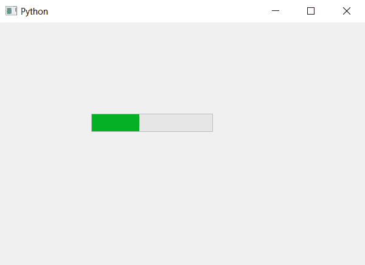

# PyQt5–进度条的 setTextVisible()方法

> 原文:[https://www . geeksforgeeks . org/pyqt 5-setextvisible-method-for-progress-bar/](https://www.geeksforgeeks.org/pyqt5-settextvisible-method-for-progress-bar/)

我们知道当我们创建一个进度条时，进度条也会显示百分比。`setTextVisible`方法用来设置进度条里面的文字应该可见还是不可见，如果我们把它设置为 True，它就会可见，否则就不可见。

> **语法:** bar.setTextVisible(False)
> 
> **自变量:**它以 bool 为自变量。
> 
> **执行的动作:**将文本设置为不可见。

下面是实现。

```
# importing libraries
from PyQt5.QtWidgets import * 
from PyQt5 import QtCore, QtGui
from PyQt5.QtGui import * 
from PyQt5.QtCore import * 
import sys

class Window(QMainWindow):

    def __init__(self):
        super().__init__()

        # setting title
        self.setWindowTitle("Python ")

        # setting geometry
        self.setGeometry(100, 100, 600, 400)

        # calling method
        self.UiComponents()

        # showing all the widgets
        self.show()

    # method for widgets
    def UiComponents(self):
        # creating progress bar
        bar = QProgressBar(self)

        # setting geometry to progress bar
        bar.setGeometry(150, 150, 200, 30)

        # set value to progress bar
        bar.setValue(40)

        # setting alignment to center
        bar.setAlignment(Qt.AlignCenter)

        # setting text visibility to false
        bar.setTextVisible(False)

# create pyqt5 app
App = QApplication(sys.argv)

# create the instance of our Window
window = Window()

# start the app
sys.exit(App.exec())
```

**输出:**
