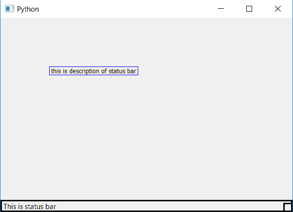

# PyQt5–状态栏的设置和访问描述

> 原文:[https://www . geeksforgeeks . org/pyqt 5-设置和访问描述状态栏/](https://www.geeksforgeeks.org/pyqt5-setting-and-accessing-description-of-a-status-bar/)

在本文中，我们将看到如何设置和访问状态栏的描述。为了设置描述，我们使用`statusBar().setAccessibleDescription()`方法，为了访问，我们使用`self.statusBar().accessibleDescription()`方法。

**状态栏的描述**是状态栏的详细信息，设置描述有助于后端更好地理解详细信息。

> **语法:**
> self.statusBar()。setAccessibleDescription(details)
> self . status bar()。accessibleDescription()
> 
> **论证:**
> 以弦为论证。
> `self.statusBar().accessibleDescription()`无需争论。
> 
> **返回:**
> 不返回任何值。
> `self.statusBar().accessibleDescription()`返回字符串。

**代码:**

```
from PyQt5.QtCore import * 
from PyQt5.QtGui import * 
from PyQt5.QtWidgets import * 
import sys

class Window(QMainWindow):
    def __init__(self):
        super().__init__()

        # set the title
        self.setWindowTitle("Python")

        # setting  the geometry of window
        self.setGeometry(60, 60, 600, 400)

        # setting status bar message
        self.statusBar().showMessage("This is status bar ")

        # setting  border to status bar
        self.statusBar().setStyleSheet("border :3px solid black;")

        # setting description to status bar
        self.statusBar().setAccessibleDescription(
                 "this is description of status bar")

        # creating a label widget to show deciption
        self.label_1 = QLabel( self)

        # moving position
        self.label_1.move(100, 100)

        # setting up the border
        self.label_1.setStyleSheet("border :1px solid blue;")

        # accessing the description
        data = self.statusBar().accessibleDescription()

        # setting text to label
        self.label_1.setText(data)

        # resizing label
        self.label_1.adjustSize()

        # show all the widgets
        self.show()

# create pyqt5 app
App = QApplication(sys.argv)

# create the instance of our Window
window = Window()

# start the app
sys.exit(App.exec())
```

**输出:**
