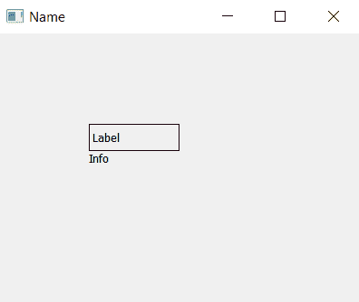

# PyQt5–设置和访问标签名称

> 原文:[https://www . geesforgeks . org/pyqt 5-设置和访问标签名称/](https://www.geeksforgeeks.org/pyqt5-setting-and-accessing-name-of-a-label/)

在设计图形用户界面(Gui)应用程序时，我们最终大多会制作许多标签。对于后端编码人员来说，很难区分标签。为了克服这种情况，需要设置标签名称，例如在数百个标签中，我们可以通过设置它们的名称来区分它们，有些是“信息”标签，有些是“警告”标签。

标签通常是在表单上显示文本的图形控件元素。它通常是静态控件；没有交互性。标签通常用于标识附近的文本框或其他小部件。

## 要设置名称–

> **语法 ：** label.setAccessibleName（name）
> 
> **自变量:**它以字符串为自变量。
> 
> **返回:**无返回值。

## 要访问名称–

> **语法:** label.accessibleName()
> 
> **论证:**不需要论证。
> 
> **返回:**返回字符串。

**代码:**

```
# importing the required libraries

from PyQt5.QtWidgets import * 
from PyQt5 import QtCore
from PyQt5 import QtGui
import sys

class Window(QMainWindow):
    def __init__(self):
        super().__init__()

        # set the title
        self.setWindowTitle("Name")

        # setting  the geometry of window
        self.setGeometry(0, 0, 400, 300)

        # creating a label widget
        self.label_1 = QLabel("Label", self)

        # moving position
        self.label_1.move(100, 100)

        # setting up border
        self.label_1.setStyleSheet("border: 1px solid black;")

        # setting up the name of label_1
        self.label_1.setAccessibleName("Info")

        # getting name of label_1
        name = self.label_1.accessibleName()

        # new label to display name
        self.label_2 = QLabel(name, self)
        self.label_2.move(100, 130)
        self.label_2.adjustSize()

        # show all the widgets
        self.show()

# create pyqt5 app
App = QApplication(sys.argv)

# create the instance of our Window
window = Window()

# start the app
sys.exit(App.exec())
```

**输出:**
