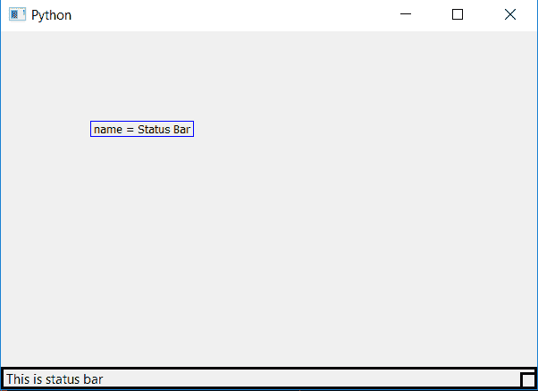

# PyQt5–设置和访问状态栏名称

> 原文:[https://www . geesforgeks . org/pyqt 5-设置和访问名称状态栏/](https://www.geeksforgeeks.org/pyqt5-setting-and-accessing-name-of-a-status-bar/)

在设计一个图形用户界面(Gui)应用程序时，我们通常会制作许多窗口，每个窗口都有状态栏。对于后端程序员来说，很难区分 windows 状态栏。为了克服这种需要设置名称的需要，例如在数百个状态栏中，我们可以通过设置它们的名称来区分它们，有些是“状态信息”状态栏，有些是“状态警告”状态栏，就像这样。

为了设置状态栏的名称，我们使用`statusBar().setAccessibleName()`方法，为了访问这个名称，我们使用`statusBar().accessibleName()`方法。

> **语法:**
> 
> ```py
> self.statusBar().setAccessibleName(name)
> statusBar().accessibleName()
> 
> ```
> 
> **论证:**
> 以弦为论证。
> `statusBar().accessibleName()`无需争论。
> 
> **返回:**
> 返回无。
> `statusBar().setAccessibleName()`返回字符串。

**代码:**

```py
from PyQt5.QtCore import * 
from PyQt5.QtGui import * 
from PyQt5.QtWidgets import * 
import sys

class Window(QMainWindow):
    def __init__(self):
        super().__init__()

        # set the title
        self.setWindowTitle("Python")

        # setting  the geometry of window
        self.setGeometry(60, 60, 600, 400)

        # setting status bar message
        self.statusBar().showMessage("This is status bar")

        # setting  border
        self.statusBar().setStyleSheet("border :3px solid black;")

        # setting name to a status bar
        self.statusBar().setAccessibleName("Status Bar")

        # creating a label widget
        self.label_1 = QLabel(self)

        # moving position
        self.label_1.move(100, 100)

        # setting up the border
        self.label_1.setStyleSheet("border :1px solid blue;")

        # getting name of status bar
        name = self.statusBar().accessibleName()

        # setting text to label
        self.label_1.setText("name = "+name)

        # resizing label
        self.label_1.adjustSize()

        # show all the widgets
        self.show()

# create pyqt5 app
App = QApplication(sys.argv)

# create the instance of our Window
window = Window()

# start the app
sys.exit(App.exec())
```

**输出:**
