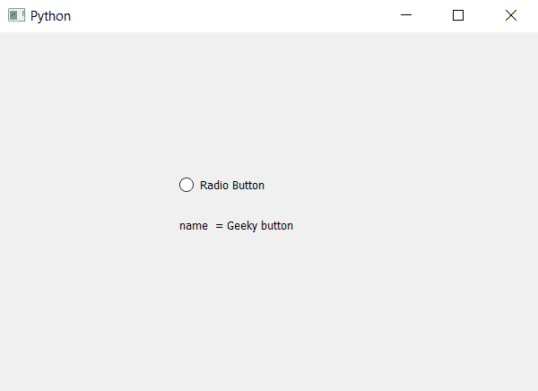

# PyQt5–单选按钮

的设置和访问名称

> 原文:[https://www . geesforgeks . org/pyqt 5-设置和访问单选按钮名称/](https://www.geeksforgeeks.org/pyqt5-setting-and-accessing-name-of-radio-button/)

在本文中，我们将了解如何设置和访问单选按钮的名称。名称基本上用于区分单选按钮，因为当我们创建图形用户界面时，我们制作了许多单选按钮，并且需要区分它们，因为一些单选按钮用于选择过滤器，一些用于选择颜色等，因此需要命名。
为了访问我们使用的 accessibleName 方法和为了设置名称我们使用的 setAccessibleName 方法。

> 用于设置名称–
> **语法:**radio _ button . setaccessiblename(name)
> **参数:**它以字符串作为参数
> **返回:**无
> 用于访问名称–
> **语法:**radio _ button . accessiblename()
> **参数:**它以无参数
> **返回:**它返回字符串

**实施程序:**
1。创建单选按钮
2。借助 setAccessibleName 方法为其设定名称
3。创建标签以显示信息
4。借助 accessibleName 方法访问单选按钮的名称，并将其存储在变量
5 中。借助 setText 方法
将该名称设置为标签，下面是实现–

## 蟒蛇 3

```
# importing libraries
from PyQt5.QtWidgets import *
from PyQt5 import QtCore, QtGui
from PyQt5.QtGui import *
from PyQt5.QtCore import *

import sys

class Window(QMainWindow):

    def __init__(self):
        super().__init__()

        # setting title
        self.setWindowTitle("Python ")

        # setting geometry
        self.setGeometry(100, 100, 600, 400)

        # calling method
        self.UiComponents()

        # showing all the widgets
        self.show()

    # method for widgets
    def UiComponents(self):
        # creating a radio button
        self.radio_button = QRadioButton(self)

        # setting geometry of radio button
        self.radio_button.setGeometry(200, 150, 120, 40)

        # setting text to radio button
        self.radio_button.setText("Radio Button")

        # setting name to radio button
        self.radio_button.setAccessibleName("Geeky button")

        # creating label to display button name
        label = QLabel(self)

        # setting geometry
        label.setGeometry(200, 200, 150, 30)

        # accessing the name
        name = self.radio_button.accessibleName()

        # showing name in label
        label.setText("name  = " + name)

# create pyqt5 app
App = QApplication(sys.argv)

# create the instance of our Window
window = Window()

# start the app
sys.exit(App.exec())
```

**输出:**

