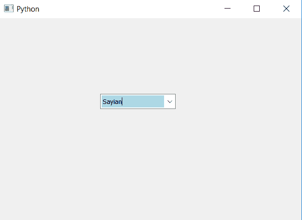

# PyQt5–将背景颜色设置为组合框的线条编辑

> 原文:[https://www . geeksforgeeks . org/pyqt 5-设置-背景色到线条编辑-of-combobox/](https://www.geeksforgeeks.org/pyqt5-setting-background-color-to-lineedit-of-combobox/)

在本文中，我们将看到如何设置组合框的行编辑部分的背景颜色，组合框的行编辑部分是显示和编辑文本的地方。

> 要为组合框的线条编辑部分添加背景色，请执行以下操作–
> 
> 1.创建组合框
> 2。创建线编辑小部件
> 3。更改线条编辑部件
> 4 的背景颜色。将行编辑小部件添加到组合框中

**语法:**

```
# creating line edit widget
line_edit = QLineEdit()

# setting background color to the line edit widget
line_edit.setStyleSheet("QLineEdit"
                        "{"
                        "background : lightblue;"
                        "}")

# adding line edit widget to combo box
self.combo_box.setLineEdit(line_edit)

```

下面是实现

```
# importing libraries
from PyQt5.QtWidgets import * 
from PyQt5 import QtCore, QtGui
from PyQt5.QtGui import * 
from PyQt5.QtCore import * 
import sys

class Window(QMainWindow):

    def __init__(self):
        super().__init__()

        # setting title
        self.setWindowTitle("Python ")

        # setting geometry
        self.setGeometry(100, 100, 600, 400)

        # calling method
        self.UiComponents()

        # showing all the widgets
        self.show()

    # method for widgets
    def UiComponents(self):

        # creating a combo box widget
        self.combo_box = QComboBox(self)

        # setting geometry of combo box
        self.combo_box.setGeometry(200, 150, 150, 30)

        # making combo box editable
        self.combo_box.setEditable(True)

        # geek list
        geek_list = ["Sayian", "Super Sayian", "Super Sayian 2", "Super Sayian B"]

        # adding list of items to combo box
        self.combo_box.addItems(geek_list)

        # creating line edit widget
        line_edit = QLineEdit()

        # setting background color to the line edit widget
        line_edit.setStyleSheet("QLineEdit"
                                "{"
                                "background : lightblue;"
                                "}")

        # adding line edit widget to combo box
        self.combo_box.setLineEdit(line_edit)

# create pyqt5 app
App = QApplication(sys.argv)

# create the instance of our Window
window = Window()

# start the app
sys.exit(App.exec())
```

**输出:**
