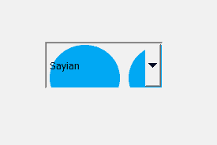
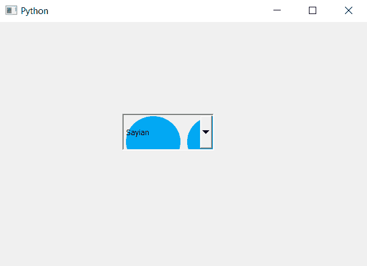

# PyQt5–将背景图像设置为组合框

> 原文:[https://www . geesforgeks . org/pyqt 5-设置-背景-图像到组合框/](https://www.geeksforgeeks.org/pyqt5-setting-background-image-to-combobox/)

在本文中，我们将了解如何为组合框设置背景图像。默认情况下，组合框没有图像，尽管我们可以设置图像。下面是带有背景图像的组合框的表示。


为了做到这一点，我们必须更改与组合框关联的样式表，下面是样式表代码

```
QComboBox
{
background-image : url(image.png);
}

```

**注意:**图像尺寸不宜大很多；如果是，组合框的大小，否则它不会显示。

下面是实现

```
# importing libraries
from PyQt5.QtWidgets import * 
from PyQt5 import QtCore, QtGui
from PyQt5.QtGui import * 
from PyQt5.QtCore import * 
import sys

class Window(QMainWindow):

    def __init__(self):
        super().__init__()

        # setting title
        self.setWindowTitle("Python ")

        # setting geometry
        self.setGeometry(100, 100, 600, 400)

        # calling method
        self.UiComponents()

        # showing all the widgets
        self.show()

    # method for widgets
    def UiComponents(self):
        # creating a check-able combo box object
        self.combo_box = QComboBox(self)

        # setting geometry of combo box
        self.combo_box.setGeometry(200, 150, 150, 60)

        # making it editable
        self.combo_box.setEditable(True)

        # geek list
        geek_list = ["Sayian", "Super Sayian", "Super Sayian 2", "Super Sayian B"]

        # adding list of items to combo box
        self.combo_box.addItems(geek_list)

        # setting style sheet of the combo box
        # adding background image to the combo box
        self.combo_box.setStyleSheet("QComboBox"
                                     "{"
                                     "background-image : url(logo.png);"
                                     "}")

# create pyqt5 app
App = QApplication(sys.argv)

# create the instance of our Window
window = Window()

window.show()

# start the app
sys.exit(App.exec())
```

**输出:**
