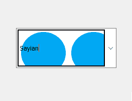
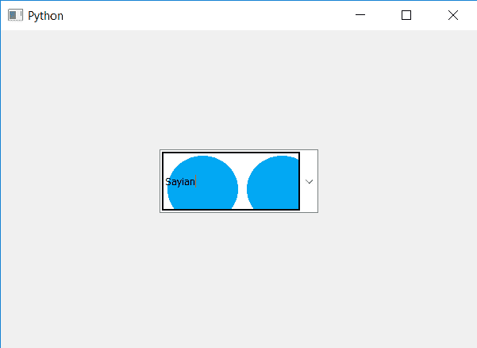

# PyQt5–将背景图像设置为组合框的线条编辑部分

> 原文:[https://www . geesforgeks . org/pyqt 5-设置-背景-图像到线条编辑-部分组合框/](https://www.geeksforgeeks.org/pyqt5-setting-background-image-to-lineedit-part-of-combobox/)

在本文中，我们将看到如何将背景图像设置到组合框的线条编辑部分。行编辑是组合框的一部分，用于查看选定的文本和编辑文本。为了设置和获取组合框的线编辑对象，我们使用了设置线编辑和线编辑方法，下面是线编辑的背景图像看起来像
的表示



为此，我们必须执行以下操作–

> 1.创建组合框
> 2。向组合框
> 3 添加项目。创建一个 QLineEdit 对象
> 4。给 QLineEdit 对象添加背景图像
> 5。将线条编辑对象添加到组合框

**语法:**

```py
# creating line edit object
line_edit = QLineEdit()

# setting style sheet of line edit
# adding background image
line_edit.setStyleSheet("QLineEdit"
                        "{"
                        "background-image : url(logo.png);"
                        "border : 2px solid black;"
                        "}")

# adding line edit to the combo box
combo_box.setLineEdit(line_edit)
```

下面是实现

## 蟒蛇 3

```py
# importing libraries
from PyQt5.QtWidgets import *
from PyQt5 import QtCore, QtGui
from PyQt5.QtGui import *
from PyQt5.QtCore import *
import sys

class Window(QMainWindow):

    def __init__(self):
        super().__init__()

        # setting title
        self.setWindowTitle("Python ")

        # setting geometry
        self.setGeometry(100, 100, 600, 400)

        # calling method
        self.UiComponents()

        # showing all the widgets
        self.show()

    # method for widgets
    def UiComponents(self):
        # creating a check-able combo box object
        self.combo_box = QComboBox(self)

        # making combo box editable
        self.combo_box.setEditable(True)

        # setting geometry of combo box
        self.combo_box.setGeometry(200, 150, 200, 80)

        # geek list
        geek_list = ["Sayian", "Super Sayian", "Super Sayian 2", "Super Sayian B"]

        # adding list of items to combo box
        self.combo_box.addItems(geek_list)

        # creating line edit object
        line_edit = QLineEdit()

        # setting style sheet of line edit
        # adding background image
        line_edit.setStyleSheet("QLineEdit"
                                "{"
                                "background-image : url(logo.png);"
                                "border : 2px solid black;"
                                "}")

        # adding line edit to the combo box
        self.combo_box.setLineEdit(line_edit)

# create pyqt5 app
App = QApplication(sys.argv)

# create the instance of our Window
window = Window()

window.show()

# start the app
sys.exit(App.exec())
```

**输出:**

