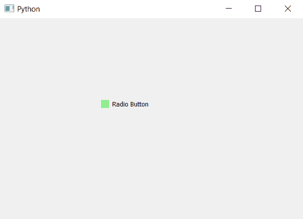

# pyqt 5–设置单选按钮

指示器的颜色

> 原文:[https://www . geesforgeks . org/pyqt 5-设置颜色到单选按钮指示器/](https://www.geeksforgeeks.org/pyqt5-setting-color-to-indicator-of-radio-button/)

在本文中，我们将了解如何为单选按钮的指示器设置颜色。默认情况下，白色与指示器相关联，尽管我们可以借助与其相关联的指示器样式表来更改颜色。

为了改变指示器的颜色，我们在样式表中将背景颜色设置为指示器。下面是实现这一点的样式表代码。

```py
QRadioButton
{
background-color : lightgreen;
}

```

**注意:**当我们改变与指示器相关联的样式表代码时，指示器的形状被设置为方形。

下面是实现。

```py
# importing libraries
from PyQt5.QtWidgets import * 
from PyQt5 import QtCore, QtGui
from PyQt5.QtGui import * 
from PyQt5.QtCore import * 
import sys

class Window(QMainWindow):

    def __init__(self):
        super().__init__()

        # setting title
        self.setWindowTitle("Python ")

        # setting geometry
        self.setGeometry(100, 100, 600, 400)

        # calling method
        self.UiComponents()

        # showing all the widgets
        self.show()

    # method for widgets
    def UiComponents(self):

        # creating a radio button
        radio_button = QRadioButton(self)

        # setting geometry of radio button
        radio_button.setGeometry(200, 150, 120, 40)

        # setting text to radio button
        radio_button.setText("Radio Button")

        # setting style sheet associated with the radio button
        # adding color to the indicator
        radio_button.setStyleSheet("QRadioButton::indicator"
                                   "{"
                                   "background-color : lightgreen"
                                   "}")

# create pyqt5 app
App = QApplication(sys.argv)

# create the instance of our Window
window = Window()

# start the app
sys.exit(App.exec())
```

**输出:**
