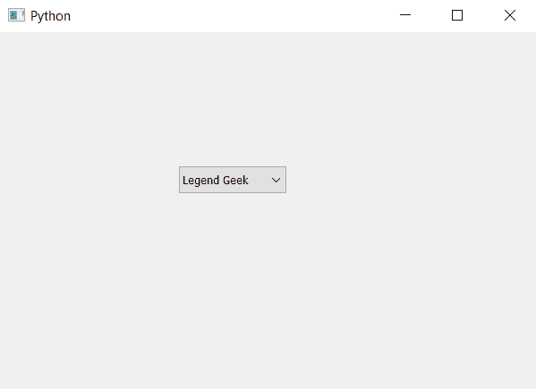

# pyqt 5–在组合框

中设置当前索引

> 原文:[https://www . geesforgeks . org/pyqt 5-设置-当前-索引-in-combobox/](https://www.geeksforgeeks.org/pyqt5-setting-current-index-in-combobox/)

在本文中，我们将看到如何在特定的索引处选择项目。默认情况下，当我们创建一个组合框时，它会显示要选择的第一个项目，但是我们可以更改索引，为此我们将使用`setCurrentIndex`方法。

> **语法:**组合框. setCurrentIndex(索引)
> 
> **自变量:**以整数为自变量
> 
> **执行的动作:**将设置给定索引的项目

以下是实施–

```py
# importing libraries
from PyQt5.QtWidgets import * 
from PyQt5 import QtCore, QtGui
from PyQt5.QtGui import * 
from PyQt5.QtCore import * 
import sys

class Window(QMainWindow):

    def __init__(self):
        super().__init__()

        # setting title
        self.setWindowTitle("Python ")

        # setting geometry
        self.setGeometry(100, 100, 600, 400)

        # calling method
        self.UiComponents()

        # showing all the widgets
        self.show()

    # method for widgets
    def UiComponents(self):

        # creating a combo box widget
        self.combo_box = QComboBox(self)

        # setting geometry of combo box
        self.combo_box.setGeometry(200, 150, 120, 30)

        # geek list
        geek_list = ["Geek", "Geeky Geek", "Legend Geek", "Ultra Legend Geek"]

        # adding list of items to combo box
        self.combo_box.addItems(geek_list)

        # setting current index
        self.combo_box.setCurrentIndex(2)

# create pyqt5 app
App = QApplication(sys.argv)

# create the instance of our Window
window = Window()

# start the app
sys.exit(App.exec())
```

**输出:**
