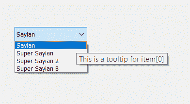
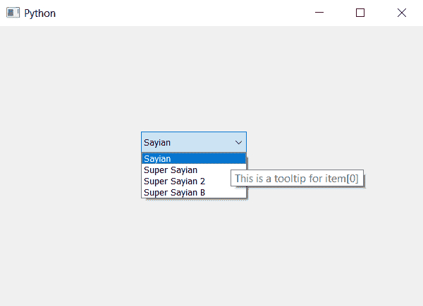

# PyQt5–为组合框的不同项目设置不同的工具提示

> 原文:[https://www . geeksforgeeks . org/pyqt 5-设置-不同-工具提示-不同-项目组合框/](https://www.geeksforgeeks.org/pyqt5-setting-different-tooltip-to-different-item-of-combobox/)

在本文中，我们将看到如何为组合框的不同项目设置不同的工具提示。我们可以借助`setToolTip`方法将工具提示设置到组合框中，为了将工具提示设置到视图部分，我们必须使用视图对象。下面是单个项目工具提示的外观。



为了做到这一点，我们必须使用以下方法

```
combo_box.setItemData(index, tool_tip_text, QtCore.Qt.ToolTipRole)

Here index is the index of the item
tool_tip_text is the string which show as tool tip

```

下面是实现

```
# importing libraries
from PyQt5.QtWidgets import * 
from PyQt5 import QtCore, QtGui
from PyQt5.QtGui import * 
from PyQt5.QtCore import * 
import sys

class Window(QMainWindow):

    def __init__(self):
        super().__init__()

        # setting title
        self.setWindowTitle("Python ")

        # setting geometry
        self.setGeometry(100, 100, 600, 400)

        # calling method
        self.UiComponents()

        # showing all the widgets
        self.show()

    # method for widgets
    def UiComponents(self):

        # creating a combo box object
        self.combo_box = QComboBox(self)

        # setting geometry of combo box
        self.combo_box.setGeometry(200, 150, 150, 30)

        # geek list
        geek_list = ["Sayian", "Super Sayian", "Super Sayian 2", "Super Sayian B"]

        # adding list of items to combo box
        self.combo_box.addItems(geek_list)

        # setting tool tip to each item
        self.combo_box.setItemData(0, "This is a tooltip for item[0]", QtCore.Qt.ToolTipRole)
        self.combo_box.setItemData(1, "This is a tooltip for item[1]", QtCore.Qt.ToolTipRole)
        self.combo_box.setItemData(2, "This is a tooltip for item[2]", QtCore.Qt.ToolTipRole)
        self.combo_box.setItemData(3, "This is a tooltip for item[3]", QtCore.Qt.ToolTipRole)

# create pyqt5 app
App = QApplication(sys.argv)

# create the instance of our Window
window = Window()

window.show()

# start the app
sys.exit(App.exec())
```

**输出:**
