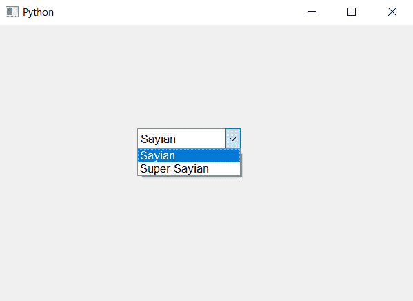

# PyQt5–为组合框

中的所有项目设置字体

> 原文:[https://www . geeksforgeeks . org/pyqt 5-设置-字体到所有项目-in-combobox/](https://www.geeksforgeeks.org/pyqt5-setting-font-to-all-the-items-in-combobox/)

在本文中，我们将看到如何改变列表中所有项目的大小和字体。为此，我们将使用`setFont`方法，该方法以 QFont 对象为参数，将其与复选框对象一起使用将改变列表中所有项目的字体。

> **语法:** check_box.setFont(字体)
> 
> **自变量:**以 Font 对象为自变量
> 
> **返回:**无

以下是实施–

```py
# importing libraries
from PyQt5.QtWidgets import * 
from PyQt5 import QtCore, QtGui
from PyQt5.QtGui import * 
from PyQt5.QtCore import * 
import sys

class Window(QMainWindow):

    def __init__(self):
        super().__init__()

        # setting title
        self.setWindowTitle("Python ")

        # setting geometry
        self.setGeometry(100, 100, 600, 400)

        # calling method
        self.UiComponents()

        # showing all the widgets
        self.show()

    # method for widgets
    def UiComponents(self):

        # creating a combo box widget
        self.combo_box = QComboBox(self)

        # setting geometry of combo box
        self.combo_box.setGeometry(200, 150, 150, 30)

        # geek list
        geek_list = ["Sayian", "Super Sayian"]

        # making it editable
        self.combo_box.setEditable(True)

        # adding list of items to combo box
        self.combo_box.addItems(geek_list)

        # font
        font = QFont('Arial', 10)

        # adding action to combo box
        self.combo_box.setFont(font)

# create pyqt5 app
App = QApplication(sys.argv)

# create the instance of our Window
window = Window()

# start the app
sys.exit(App.exec())
```

**输出:**
