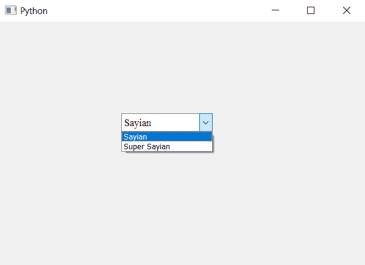

# PyQt5–为组合框

的行编辑框中的项目设置字体

> 原文:[https://www . geesforgeks . org/pyqt 5-设置-字体到行内项目-编辑框-组合框/](https://www.geeksforgeeks.org/pyqt5-setting-font-to-the-item-in-line-edit-box-of-combobox/)

在本文中，我们将看到如何改变可编辑的项目的大小和字体。如果我们使用以`QFont`对象为参数的`setFont`方法，将其与复选框对象一起使用将改变列表中所有项目的字体。

> **要仅更改可编辑框中项目的字体和大小，请执行以下操作–**
> 
> 1.创建组合框
> 2。使其可编辑组合框(可选)
> 3。从组合框
> 4 中获取线编辑(可编辑框)对象。使用`setFont`方法更改线条编辑的字体

以下是实施–

```
# importing libraries
from PyQt5.QtWidgets import * 
from PyQt5 import QtCore, QtGui
from PyQt5.QtGui import * 
from PyQt5.QtCore import * 
import sys

class Window(QMainWindow):

    def __init__(self):
        super().__init__()

        # setting title
        self.setWindowTitle("Python ")

        # setting geometry
        self.setGeometry(100, 100, 600, 400)

        # calling method
        self.UiComponents()

        # showing all the widgets
        self.show()

    # method for widgets
    def UiComponents(self):

        # creating a combo box widget
        self.combo_box = QComboBox(self)

        # setting geometry of combo box
        self.combo_box.setGeometry(200, 150, 150, 30)

        # geek list
        geek_list = ["Sayian", "Super Sayian"]

        # making it editable
        self.combo_box.setEditable(True)

        # adding list of items to combo box
        self.combo_box.addItems(geek_list)

        # font
        font = QFont('Times', 10)

        # getting the line edit of combo box
        line_edit = self.combo_box.lineEdit()

        # setting line font to the line edit
        line_edit.setFont(font)

# create pyqt5 app
App = QApplication(sys.argv)

# create the instance of our Window
window = Window()

# start the app
sys.exit(App.exec())
```

**输出:**
