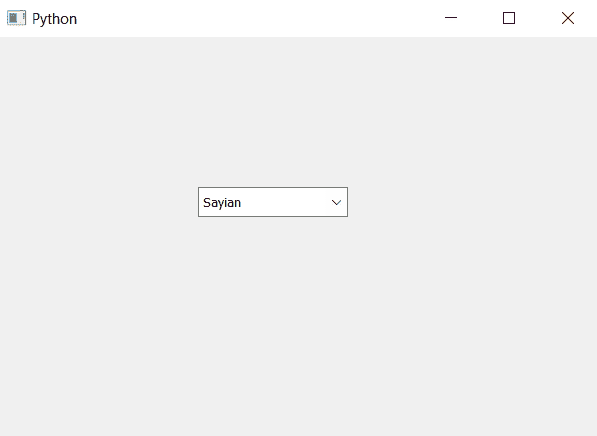

# PyQt5–设置组合框的编辑线

> 原文:[https://www . geesforgeks . org/pyqt 5-设置-行-编辑-到-组合框/](https://www.geeksforgeeks.org/pyqt5-setting-line-edit-to-the-combobox/)

在本文中，我们将看到如何将 line edit 设置为组合框，line edit 是 pyqt5 中的小部件。行编辑允许用户输入和编辑单行纯文本，具有一系列有用的编辑功能，包括撤消和重做、剪切和粘贴以及拖放。

为了给组合框添加行编辑，我们使用`setLineEdit`方法，这样我们可以使用行编辑小部件在组合框中输入项目，即使它处于不可编辑状态。

> **语法:**组合框
> 
> **参数:**它以 QLineEdit 对象为参数
> 
> **执行的操作:**这将在组合框中添加行编辑

以下是实施–

```
# importing libraries
from PyQt5.QtWidgets import * 
from PyQt5 import QtCore, QtGui
from PyQt5.QtGui import * 
from PyQt5.QtCore import * 
import sys

class Window(QMainWindow):

    def __init__(self):
        super().__init__()

        # setting title
        self.setWindowTitle("Python ")

        # setting geometry
        self.setGeometry(100, 100, 600, 400)

        # calling method
        self.UiComponents()

        # showing all the widgets
        self.show()

    # method for widgets
    def UiComponents(self):

        # creating a combo box widget
        self.combo_box = QComboBox(self)

        # setting geometry of combo box
        self.combo_box.setGeometry(200, 150, 150, 30)

        # geek list
        geek_list = ["Sayian", "Super Saiyan", "Super Sayian 2"]

        # adding list of items to combo box
        self.combo_box.addItems(geek_list)

        # creating a line edit
        edit = QLineEdit(self)

        # setting line edit
        self.combo_box.setLineEdit(edit)

# create pyqt5 app
App = QApplication(sys.argv)

# create the instance of our Window
window = Window()

# start the app
sys.exit(App.exec())
```

**输出:**
