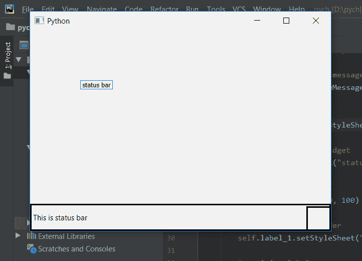

# pyqt 5–设置状态栏不同侧的填充尺寸

> 原文:[https://www . geeksforgeeks . org/pyqt 5-设置-填充-状态栏不同侧的大小/](https://www.geeksforgeeks.org/pyqt5-setting-padding-size-at-different-sides-of-status-bar/)

在本文中，我们将看到如何为状态栏的不同边缘设置不同的填充大小。

状态栏允许我们只为顶部和底部边缘设置填充，没有可用于右侧或左侧边缘的填充。我们可以在样式表中使用`padding`设置填充，为了设置不同的填充大小，我们将在样式表中使用`padding-top`和`padding-bottom`。

**注意:**我们可以为不同的边设置填充大小，尽管由于状态栏的质量，即它总是使文本垂直位于状态栏的中间，它会用较小的边覆盖填充，并使其等于较大的尺寸。

> **语法:**
> 
> ```
> self.statusBar().setStyleSheet("border :3px solid black;"
>                                "padding-top: 25px; "
>                                "padding-bottom: 25px;")
> 
> ```
> 
> **自变量:**它以字符串为自变量。
> 
> **执行的动作:**它在两侧设置填充，但被覆盖，并设置了最大长度填充。

**代码:**

```
from PyQt5.QtCore import * 
from PyQt5.QtGui import * 
from PyQt5.QtWidgets import * 
import sys

class Window(QMainWindow):
    def __init__(self):
        super().__init__()

        # set the title
        self.setWindowTitle("Python")

        # setting  the geometry of window
        self.setGeometry(60, 60, 600, 400)

        # setting status bar message
        self.statusBar().showMessage("This is status bar")

        # setting  border and padding with different sizes
        self.statusBar().setStyleSheet("border :3px solid black;"
                                       "padding-top: 25px; "
                                       "padding-bottom: 10px;")

        # creating a label widget
        self.label_1 = QLabel("status bar", self)

        # moving position
        self.label_1.move(100, 100)

        # setting up the border
        self.label_1.setStyleSheet("border :1px solid blue;")

        # resizing label
        self.label_1.adjustSize()

        # show all the widgets
        self.show()

# create pyqt5 app
App = QApplication(sys.argv)

# create the instance of our Window
window = Window()

# start the app
sys.exit(App.exec())
```

**输出:**
