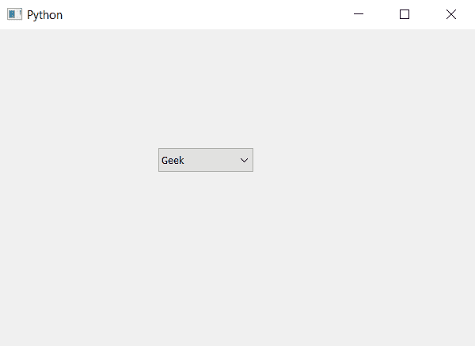

# pyqt 5–在组合框

中为项目设置角色

> 原文:[https://www . geeksforgeeks . org/pyqt 5-设置-角色到项目组合框/](https://www.geeksforgeeks.org/pyqt5-setting-role-to-item-in-combobox/)

在本文中，我们将看到如何在组合框中设置项目角色，默认情况下，当我们创建一个组合框并向其中添加项目时，没有为项目设置任何角色，为了设置这一点，我们将使用`setItemData`方法

> **语法:**组合框. setItemData(索引，角色)
> 
> **参数:**它需要两个参数一个是整数即索引或项，另一个是字符串即项的角色
> 
> **执行的操作:**它将为项目分配角色

以下是实施–

```py
# importing libraries
from PyQt5.QtWidgets import * 
from PyQt5 import QtCore, QtGui
from PyQt5.QtGui import * 
from PyQt5.QtCore import * 
import sys

class Window(QMainWindow):

    def __init__(self):
        super().__init__()

        # setting title
        self.setWindowTitle("Python ")

        # setting geometry
        self.setGeometry(100, 100, 600, 400)

        # calling method
        self.UiComponents()

        # showing all the widgets
        self.show()

    # method for widgets
    def UiComponents(self):

        # creating a combo box widget
        self.combo_box = QComboBox(self)

        # setting geometry of combo box
        self.combo_box.setGeometry(200, 150, 120, 30)

        # geek list
        geek_list = ["Geek", "Geeky Geek", "Legend Geek", "Ultra Legend Geek"]

        # adding list of items to combo box
        self.combo_box.addItems(geek_list)

        # setting roles to the items
        self.combo_box.setItemData(0, "First role")
        self.combo_box.setItemData(1, "Second role")
        self.combo_box.setItemData(2, "Third role")
        self.combo_box.setItemData(3, "Forth role")

# create pyqt5 app
App = QApplication(sys.argv)

# create the instance of our Window
window = Window()

# start the app
sys.exit(App.exec())
```

**输出:**
