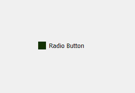
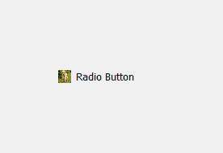
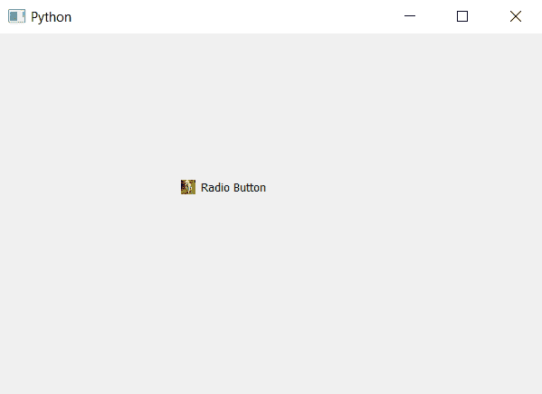

# pyqt 5–将皮肤设置为单选按钮

的指示器

> 原文:[https://www . geeksforgeeks . org/pyqt 5-设置皮肤到指示器的单选按钮/](https://www.geeksforgeeks.org/pyqt5-setting-skin-to-indicator-of-radio-button/)

在这篇文章中，我们将看到如何设置皮肤的指示单选按钮。，指示器是单选按钮的一部分，指示单选按钮是否被选中。与背景图像不同，皮肤会根据指示器的大小自行调整。下面是背景图像指示器与带有皮肤的指示器的图示。

 

**注意:**当我们改变样式表时，指示器的形状变为方形。
为了做到这一点，我们必须改变与单选按钮对象相关的指示器的样式表代码，下面是样式表代码。

```
QRadioButton::indicator
{
border-image : url(image.png);
}
```

下面是实现–

## 蟒蛇 3

```
# importing libraries
from PyQt5.QtWidgets import *
from PyQt5 import QtCore, QtGui
from PyQt5.QtGui import *
from PyQt5.QtCore import *
import sys

class Window(QMainWindow):

    def __init__(self):
        super().__init__()

        # setting title
        self.setWindowTitle("Python ")

        # setting geometry
        self.setGeometry(100, 100, 600, 400)

        # calling method
        self.UiComponents()

        # showing all the widgets
        self.show()

    # method for widgets
    def UiComponents(self):

        # creating a radio button
        self.radio_button = QRadioButton(self)

        # setting geometry of radio button
        self.radio_button.setGeometry(200, 150, 120, 40)

        # setting text to radio button
        self.radio_button.setText("Radio Button")

        # changing style sheet code of radio button
        # adding border image to the indicator
        self.radio_button.setStyleSheet("QRadioButton::indicator"
                                        "{"
                                        "border-image : url(image.png)"
                                        "}")

# create pyqt5 app
App = QApplication(sys.argv)

# create the instance of our Window
window = Window()

# start the app
sys.exit(App.exec())
```

**输出:**

