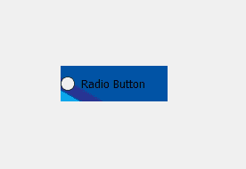
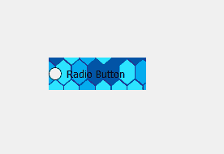
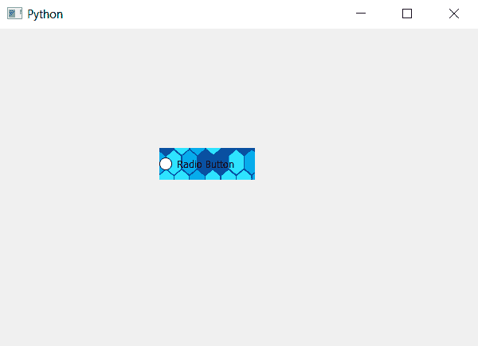

# pyqt 5–将皮肤设置为单选按钮

> 原文:[https://www . geesforgeks . org/pyqt 5-设置-皮肤到单选按钮/](https://www.geeksforgeeks.org/pyqt5-setting-skin-to-radio-button/)

在本文中，我们将看到如何设置皮肤单选按钮。不像背景图片皮肤根据单选按钮的大小自行调整。下面是带有背景图像的单选按钮与带有皮肤的单选按钮的图示。
 

为此，我们必须更改与单选按钮相关联的样式表代码。下面是样式表代码。

```py
QRadioButton
{
border-image : url(image.png);
}

```

下面是实现。

```py
# importing libraries
from PyQt5.QtWidgets import * 
from PyQt5 import QtCore, QtGui
from PyQt5.QtGui import * 
from PyQt5.QtCore import * 
import sys

class Window(QMainWindow):

    def __init__(self):
        super().__init__()

        # setting title
        self.setWindowTitle("Python ")

        # setting geometry
        self.setGeometry(100, 100, 600, 400)

        # calling method
        self.UiComponents()

        # showing all the widgets
        self.show()

    # method for widgets
    def UiComponents(self):

        # creating a radio button
        self.radio_button = QRadioButton(self)

        # setting geometry of radio button
        self.radio_button.setGeometry(200, 150, 120, 40)

        # setting text to radio button
        self.radio_button.setText("Radio Button")

        # changing style sheet code of radio button
        # adding border image to the radio button
        self.radio_button.setStyleSheet("QRadioButton"
                                        "{"
                                        "background-image : url(skin.png);"
                                        "}")

# create pyqt5 app
App = QApplication(sys.argv)

# create the instance of our Window
window = Window()

# start the app
sys.exit(App.exec())
```

**输出:**
