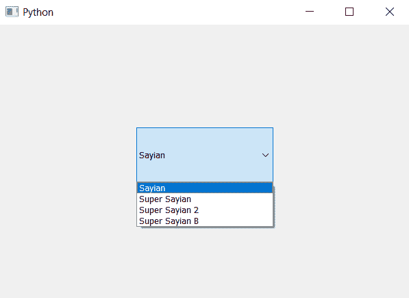
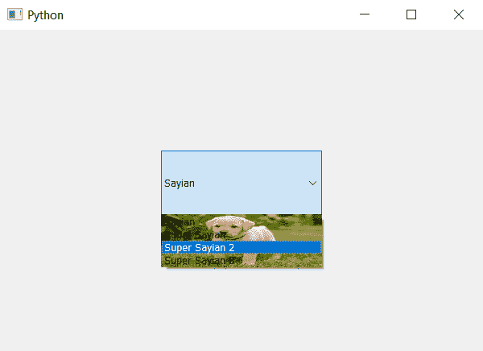

# PyQt5–鼠标悬停时设置皮肤查看组合框的一部分

> 原文:[https://www . geesforgeks . org/pyqt 5-设置-皮肤到视图-部分组合框-鼠标悬停时/](https://www.geeksforgeeks.org/pyqt5-setting-skin-to-view-part-of-combobox-when-mouse-hover/)

在本文中，我们将看到如何在鼠标悬停在组合框的视图部分时设置皮肤。视图部分是所有项目显示的地方，当组合框被按下时，视图部分显示它自己。皮肤基本上是根据视图部分的大小来调整自身的背景图像。`setView`和`view`方法用于设置和获取组合框的视图对象，默认组合框有 QListView 类型对象。

为此，我们必须更改与组合框关联的样式表代码，下面是样式表代码

```py
QListView::hover
{
border-image : url(image.png);
}

```

下面是实现

```py
# importing libraries
from PyQt5.QtWidgets import * 
from PyQt5 import QtCore, QtGui
from PyQt5.QtGui import * 
from PyQt5.QtCore import * 
import sys

class Window(QMainWindow):

    def __init__(self):
        super().__init__()

        # setting title
        self.setWindowTitle("Python ")

        # setting geometry
        self.setGeometry(100, 100, 600, 400)

        # calling method
        self.UiComponents()

        # showing all the widgets
        self.show()

    # method for widgets
    def UiComponents(self):
        # creating a check-able combo box object
        self.combo_box = QComboBox(self)

        # setting geometry of combo box
        self.combo_box.setGeometry(200, 150, 200, 80)

        # making combo box editable
        # self.combo_box.setEditable(True)

        # geek list
        geek_list = ["Sayian", "Super Sayian", "Super Sayian 2", "Super Sayian B"]

        # adding list of items to combo box
        self.combo_box.addItems(geek_list)

        # setting style sheet
        # adding skin to list view when mouse hover over it
        self.combo_box.setStyleSheet("QListView::hover"
                                     "{"
                                     "border-image : url(image.png);"
                                     "border : 1px solid black;"
                                     "}")

# create pyqt5 app
App = QApplication(sys.argv)

# create the instance of our Window
window = Window()

window.show()

# start the app
sys.exit(App.exec())
```

**输出:**


当鼠标悬停在其上时

