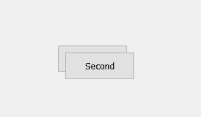
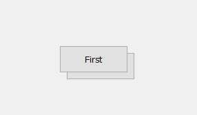
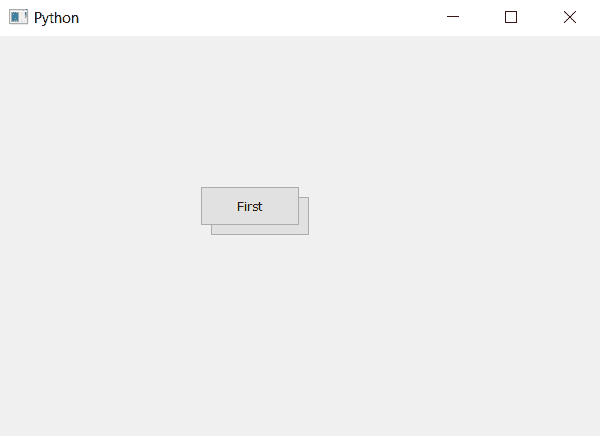

# PyQt5 |设置按钮可见优先级

> 原文:[https://www . geesforgeks . org/pyqt 5-设置-可见-优先级-按下按钮/](https://www.geeksforgeeks.org/pyqt5-setting-visible-priority-to-push-button/)

在本文中，我们将看到如何设置按钮的可见优先级。当我们在同一个位置创建两个按钮时，在末尾创建的按钮将覆盖旧按钮，但是通过设置按钮的优先级，我们可以管理哪个按钮应该在上面，哪个应该在下面。

例如，如果我们在同一位置创建两个按钮，它们看起来像这样

我们可以看到只有第二个按钮可见，虽然我们可以使第二个按钮半透明以看到第一个按钮，但第一个按钮仍然不可点击，但是如果我们设置较低的优先级，即使第二个按钮的窗口较低，它们将看起来像这样。



> **语法:**按钮。下()
> 
> **论证:**不需要论证。
> 
> **执行的动作:**将按钮设置为降低窗口。

**代码:**

```py
# importing libraries
from PyQt5.QtWidgets import * 
from PyQt5.QtGui import * 
from PyQt5.QtCore import * 
import sys

class Window(QMainWindow):
    def __init__(self):
        super().__init__()

        # setting title
        self.setWindowTitle("Python ")

        # setting geometry
        self.setGeometry(100, 100, 600, 400)

        # calling method
        self.UiComponents()

        # showing all the widgets
        self.show()

    # method for widgets
    def UiComponents(self):

        # creating a push button
        button1 = QPushButton("First", self)

        # setting geometry of button
        button1.setGeometry(200, 150, 100, 40)

        # adding action to a button
        button1.clicked.connect(self.clickme)

        # creating a push button
        button2 = QPushButton("Second", self)

        # setting geometry of button
        button2.setGeometry(210, 160, 100, 40)

        # adding action to a button
        button2.clicked.connect(self.clickme)

        # make it in lower the window
        button2.lower()

    # action method
    def clickme(self):

        # printing pressed
        print("pressed")

# create pyqt5 app
App = QApplication(sys.argv)

# create the instance of our Window
window = Window()

# start the app
sys.exit(App.exec())
```

**输出:**
