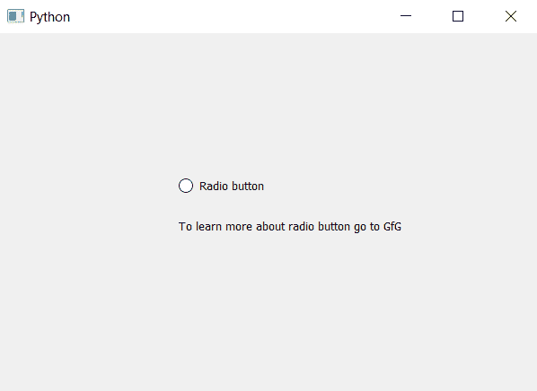

# pyqt5-setwhats this()帮助文本或单选按钮

> 原文:[https://www . geesforgeks . org/pyqt5-setwhatshis-help-text-of-radio-button/](https://www.geeksforgeeks.org/pyqt5-setwhatsthis-help-text-of-radio-button/)

在本文中，我们将了解如何设置和访问单选按钮的帮助文本。帮助文本是用于了解未来信息或我们可以获得哪些关于单选按钮的新信息的文本，为了设置帮助文本，我们使用`setWhatsThis`方法，为了访问，我们使用`whatsThis`方法。

> 用于将帮助文本设置为单选按钮–
> **语法:**单选按钮. setwhatshis(文本)
> **参数:**它将字符串作为参数
> **返回:**无
> 
> 用于访问单选按钮的帮助文本–
> **语法:**单选按钮. what this()
> **参数:**不需要参数
> **返回:**返回字符串

下面是实现。

```
# importing libraries
from PyQt5.QtWidgets import * 
from PyQt5 import QtCore, QtGui
from PyQt5.QtGui import * 
from PyQt5.QtCore import * 
import sys

class Window(QMainWindow):

    def __init__(self):
        super().__init__()

        # setting title
        self.setWindowTitle("Python ")

        # setting geometry
        self.setGeometry(100, 100, 600, 400)

        # calling method
        self.UiComponents()

        # showing all the widgets
        self.show()

    # method for widgets
    def UiComponents(self):
        # creating a radio button
        self.radio_button = QRadioButton("Radio button", self)

        # setting geometry of radio button
        self.radio_button.setGeometry(200, 150, 120, 40)

        # setting help text
        self.radio_button.setWhatsThis(
            "To learn more about radio button go to GfG")

        # creating label to show help text
        label = QLabel(self)

        # setting geometry of label
        label.setGeometry(200, 200, 350, 30)

        # getting help of text of radio button
        text = self.radio_button.whatsThis()

        # showing text in label
        label.setText(text)

# create pyqt5 app
App = QApplication(sys.argv)

# create the instance of our Window
window = Window()

# start the app
sys.exit(App.exec())
```

**输出:**
