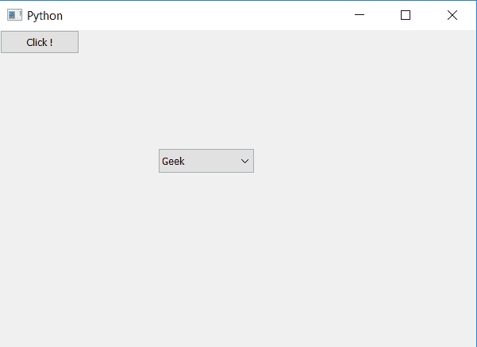
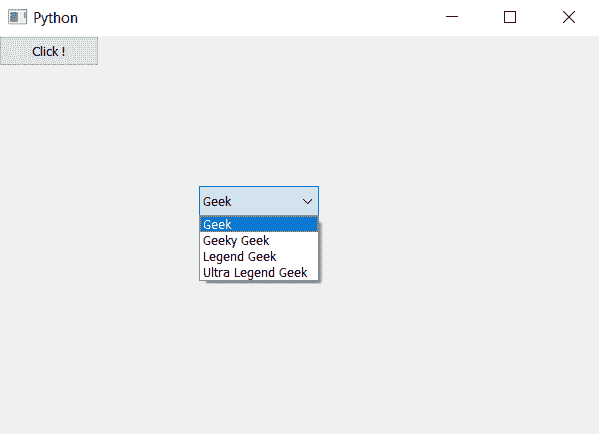

# PyQt5–按下按钮时显示组合框的弹出项目

> 原文:[https://www . geesforgeks . org/pyqt5-show-pop-items-of-combobox-当按下按钮时/](https://www.geeksforgeeks.org/pyqt5-show-pop-up-items-of-combobox-when-push-button-is-pressed/)

在本文中，我们将看到如何制作组合框来显示其元素，而无需点击它。为了做到这一点，我们将使用`showPopup`方法。

> **语法:**组合框. showPopup()
> 
> **论证:**不需要论证
> 
> **执行的动作:**将显示弹出的元素

**实施步骤:**

1.创建组合框
2。在组合框中添加项目
3。创建按钮
4。向按钮添加动作，这样当按钮被按下时，方法将被调用
5。方法内显示借助`showPopup`方法弹出。

以下是实施–

```py
# importing libraries
from PyQt5.QtWidgets import * 
from PyQt5 import QtCore, QtGui
from PyQt5.QtGui import * 
from PyQt5.QtCore import * 
import sys

class Window(QMainWindow):

    def __init__(self):
        super().__init__()

        # setting title
        self.setWindowTitle("Python ")

        # setting geometry
        self.setGeometry(100, 100, 600, 400)

        # calling method
        self.UiComponents()

        # showing all the widgets
        self.show()

    # method for widgets
    def UiComponents(self):

        # creating a combo box widget
        self.combo_box = QComboBox(self)

        # setting geometry of combo box
        self.combo_box.setGeometry(200, 150, 120, 30)

        # geek list
        geek_list = ["Geek", "Geeky Geek", "Legend Geek", "Ultra Legend Geek"]

        # adding list of items to combo box
        self.combo_box.addItems(geek_list)

        # creating push button
        button = QPushButton("Click !", self)

        # adding action to the button
        button.pressed.connect(self.action)

    def action(self):

        # showing the pop up
        self.combo_box.showPopup()

# create pyqt5 app
App = QApplication(sys.argv)

# create the instance of our Window
window = Window()

# start the app
sys.exit(App.exec())
```

**输出:**

后点击
按钮