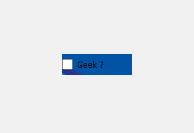
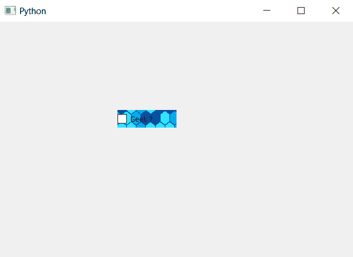

# PyQt5–复选框

中的皮肤

> 原文:[https://www.geeksforgeeks.org/pyqt5-skin-in-check-box/](https://www.geeksforgeeks.org/pyqt5-skin-in-check-box/)

在本文中，我们将看到如何将皮肤设置为复选框。皮肤也是一种背景图像，但它会根据复选框的大小进行自我调整。下面是背景图像复选框和带皮肤复选框的图示。

 

为了做到这一点，我们必须改变样式表，并且必须设置皮肤，它与复选框对象一起使用。下面是样式表代码。

```py
QCheckBox
{
border-image : url(skin.png);
}

```

下面是实现。

```py
# importing libraries
from PyQt5.QtWidgets import * 
from PyQt5 import QtCore, QtGui
from PyQt5.QtGui import * 
from PyQt5.QtCore import * 
import sys

class Window(QMainWindow):

    def __init__(self):
        super().__init__()

        # setting title
        self.setWindowTitle("Python ")

        # setting geometry
        self.setGeometry(100, 100, 600, 400)

        # calling method
        self.UiComponents()

        # showing all the widgets
        self.show()

    # method for widgets
    def UiComponents(self):

        # creating the check-box
        checkbox = QCheckBox('Geek ?', self)

        # setting geometry of check box
        checkbox.setGeometry(200, 150, 100, 30)

        # setting stylesheet
        # adding skin to check box
        checkbox.setStyleSheet("QCheckBox"
                               "{"
                               "border-image : url(skin.png);"
                               "}")

# create pyqt5 app
App = QApplication(sys.argv)

# create the instance of our Window
window = Window()

# start the app
sys.exit(App.exec())
```

**输出:**
