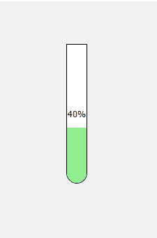
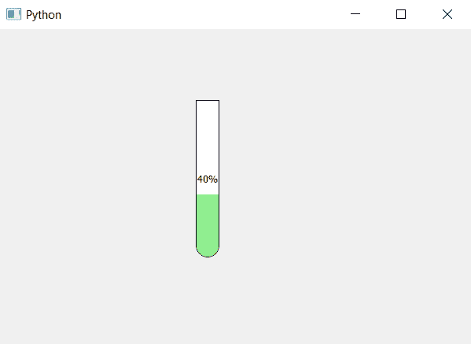

# pyqt 5–试管进度条

> 原文:[https://www.geeksforgeeks.org/pyqt5-test-tube-progress-bar/](https://www.geeksforgeeks.org/pyqt5-test-tube-progress-bar/)

在本文中，我们将看到如何创建试管形状的进度条。基本上试管形状进度条是底部有圆角边的垂直进度条。下面是试管进度条的表示。



> **为了做到这一点，我们必须做以下工作–**
> 
> 1.将进度条的方向从水平更改为垂直
> 2。在底部的进度条上创建圆角
> 3。在底部创建进度条的圆角。

为了创建进度条和进度条的圆形底部，下面是样式表代码。

```py
QProgressBar
{
border: 1px solid black;
border-bottom-right-radius: 15px;
border-bottom-left-radius: 15px;
}
QProgressBar::chunk 
{
border-bottom-right-radius: 14px;
border-bottom-left-radius: 14px;
background : lightgreen;
}      

```

下面是实现。

```py
# importing libraries
from PyQt5.QtWidgets import * 
from PyQt5 import QtCore, QtGui
from PyQt5.QtGui import * 
from PyQt5.QtCore import * 
import sys

class Window(QMainWindow):

    def __init__(self):
        super().__init__()

        # setting title
        self.setWindowTitle("Python ")

        # setting geometry
        self.setGeometry(100, 100, 600, 400)

        # calling method
        self.UiComponents()

        # showing all the widgets
        self.show()

    # method for widgets
    def UiComponents(self):
        # creating progress bar
        bar = QProgressBar(self)

        # setting geometry to progress bar
        bar.setGeometry(250, 90, 30, 200)

        # set value to progress bar
        bar.setValue(40)

        # setting alignment to center
        bar.setAlignment(Qt.AlignCenter)

        # setting orientation to vertical
        bar.setOrientation(QtCore.Qt.Vertical)

        # setting rounder border at the bottom
        # setting rounded border to the bottom of bar of progress bar
        # and color
        bar.setStyleSheet("QProgressBar"
                          "{"
                          "border : 1px solid black;"
                          "border-bottom-right-radius: 15px;"
                          "border-bottom-left-radius: 15px;"
                          "}"
                          "QProgressBar::chunk"
                          "{"                         

                          "border-bottom-right-radius: 14px;"
                          "border-bottom-left-radius: 14px;"
                          "background : lightgreen"
                          "}"
                          )

# create pyqt5 app
App = QApplication(sys.argv)

# create the instance of our Window
window = Window()

# start the app
sys.exit(App.exec())
```

**输出:**
