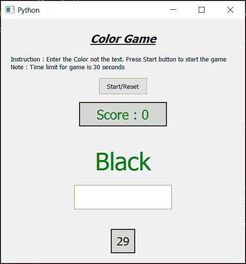

# PyQt5–彩色游戏

> 原文:[https://www.geeksforgeeks.org/pyqt5-the-color-game/](https://www.geeksforgeeks.org/pyqt5-the-color-game/)

在本文中，我们将看到如何使用 PyQt5 创建一个彩色游戏。在这个游戏中，用户必须通过给给定单词的颜色命名来获得最高分，并且为了迷惑玩家，文本将具有不同的颜色名称。下面是彩色游戏的样子



> **GUI 实现步骤:**
> 1。创建一个头部标签来显示游戏的名称，设置其功能，如对齐颜色等。
> 2。创建一个说明标签，将说明告诉用户
> 3。创建一个按钮开始/重置游戏
> 4。创建标签以显示分数
> 5。创建一个线编辑来获得用户的输入
> 6。创建一个倒计时 30 秒的标签
> 
> **后端实现步骤:**
> 1。创建开始标志、颜色列表、计数器值变量和分值变量
> 2。创建一个定时器对象，一秒钟后调用一个方法
> 3。在计时器方法中，检查开始标志是否为真，将计数器值设置为计数器标签，并减少计数值
> 4。检查计数器变量是否等于零，然后使开始标志为假，并使线路编辑禁用
> 5。向开始按钮
> 6 添加动作。在开始按钮动作中，将开始值设为真，将计数值设为 30，并清除行编辑文本
> 7。从颜色列表中随机选择，并将该颜色设置为颜色标签
> 8。再次从列表中随机选择，并将该文本设置为标签
> 9。按下回车键
> 10 时，在线编辑中添加动作。在线编辑操作中，用随机选项检查输入的文本，如果匹配，则增加分值，并用另一个随机值更改颜色标签颜色和文本。

下面是实现

```py
# importing libraries
from PyQt5.QtWidgets import * 
from PyQt5 import QtCore, QtGui
from PyQt5.QtGui import * 
from PyQt5.QtCore import * 
import random
import sys

class Window(QMainWindow):

    def __init__(self):
        super().__init__()

        # setting title
        self.setWindowTitle("Python ")

        # setting geometry
        self.setGeometry(100, 100, 500, 500)

        # calling method
        self.UiComponents()

        # showing all the widgets
        self.show()

        # counter
        self.count_value = 30

        # score
        self.score_value = 0

        # start flag
        self.start_Flag = False

        # list of possible colour.
        self.color_list = ['Red', 'Blue', 'Green', 'Pink', 'Black',
                   'Yellow', 'Orange', 'Purple', 'Brown']

        # method for components
    def UiComponents(self):

        # creating head label
        head = QLabel("Color Game", self)

        # setting geometry to the head
        head.setGeometry(100, 10, 300, 60)

        # font
        font = QFont('Times', 14)
        font.setBold(True)
        font.setItalic(True)
        font.setUnderline(True)

        # setting font to the head
        head.setFont(font)

        # setting alignment of the head
        head.setAlignment(Qt.AlignCenter)

        # instruction label
        instruction = QLabel("Instruction : Enter the Color not the text. "
                             "Press Start button to start the game          "
                             "Note : Time limit for game is 30 seconds", self)

        # making it multi line
        instruction.setWordWrap(True)

        # setting geometry to the label
        instruction.setGeometry(20, 60, 460, 60)

        # creating start button
        start = QPushButton("Start / Reset", self)

        # setting geometry to the push button
        start.setGeometry(200, 120, 100, 35)

        # adding action to the start button
        start.clicked.connect(self.start_action)

        # creating a score label
        self.score = QLabel("Score : 0", self)

        # setting geometry
        self.score.setGeometry(160, 170, 180, 50)

        # setting alignment
        self.score.setAlignment(Qt.AlignCenter)

        # setting font
        self.score.setFont(QFont('Times', 16))

        # setting style sheet
        self.score.setStyleSheet("QLabel"
                                 "{"
                                 "border : 2px solid black;"
                                 "color : green;"
                                 "background : lightgrey;"
                                 "}")

        # creating label to show color
        self.color = QLabel("Color Name", self)

        # setting geometry
        self.color.setGeometry(50, 230, 400, 120)

        # setting alignment
        self.color.setAlignment(Qt.AlignCenter)

        # setting font
        self.color.setFont(QFont('Times', 30))

        # creating a line edit
        self.input_text = QLineEdit(self)

        # setting geometry
        self.input_text.setGeometry(150, 340, 200, 50)

        # setting font
        self.input_text.setFont(QFont('Arial', 14))

        # making line edit disabled
        self.input_text.setDisabled(True)

        # adding action to it when enter is pressed
        self.input_text.returnPressed.connect(self.input_action)

        # creating a timer label
        self.count = QLabel("30", self)

        # setting geometry
        self.count.setGeometry(225, 430, 50, 50)

        # setting alignment
        self.count.setAlignment(Qt.AlignCenter)

        # setting font
        self.count.setFont(QFont('Times', 14))

        # setting style sheet
        self.count.setStyleSheet("border : 2px solid black;"
                                 "background : lightgrey;")

        # creating a timer object
        timer = QTimer(self)

        # adding action to the timer
        timer.timeout.connect(self.show_time)

        # start timer
        timer.start(1000)

    def show_time(self):

        if self.start_Flag:

            # showing count value to label
            self.count.setText(str(self.count_value))

            # checking if count value is zero
            if self.count_value == 0:

                # making start flag to false
                self.start_Flag = False

                # making line edit widget disable
                self.input_text.setDisabled(True)

            # decrementing the count value
            self.count_value -= 1

    def start_action(self):

        # making start flag true
        self.start_Flag = True

        # resetting score
        self.score.setText("Score : 0")
        self.score_value = 0

        # resetting count value
        self.count_value = 30

        # clearing line edit text
        self.input_text.clear()

        # making line edit enabled
        self.input_text.setEnabled(True)

        # getting random color
        self.random_color = random.choice(self.color_list)

        # making color choice random color
        self.random_color.lower()

        # setting random color to the label
        self.color.setStyleSheet("color : " + self.random_color + ";")

        # getting another random color name
        random_text = random.choice(self.color_list)

        # setting text to label
        self.color.setText(random_text)

    def input_action(self):

        # get the line edit test
        text = self.input_text.text()

        # making text lower case
        text.lower()

        # checking text with random color
        if text == self.random_color:
            # clearing line edit text
            self.input_text.clear()

            # incrementing score value
            self.score_value += 1

            # setting score to the score label
            self.score.setText("Score : " + str(self.score_value))

            # getting random color
            self.random_color = random.choice(self.color_list)

            # making color choice random color
            self.random_color.lower()

            # setting random color to the label
            self.color.setStyleSheet("color : " + self.random_color + ";")

            # getting another random color name
            random_text = random.choice(self.color_list)

            # setting text to label
            self.color.setText(random_text)

# create pyqt5 app
App = QApplication(sys.argv)

# create the instance of our Window
window = Window()

# start the app
sys.exit(App.exec())
```

**输出:**

<video class="wp-video-shortcode" id="video-427482-1" width="640" height="640" preload="metadata" controls=""><source type="video/mp4" src="https://media.geeksforgeeks.org/wp-content/uploads/20200605205414/Python-2020-06-05-20-53-13.mp4?_=1">[https://media.geeksforgeeks.org/wp-content/uploads/20200605205414/Python-2020-06-05-20-53-13.mp4](https://media.geeksforgeeks.org/wp-content/uploads/20200605205414/Python-2020-06-05-20-53-13.mp4)</video>