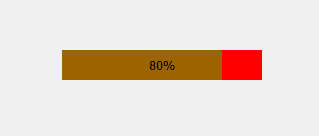
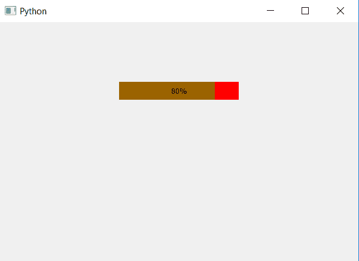

# PyQt5–进度条的半透明条

> 原文:[https://www . geesforgeks . org/pyqt 5-半透明进度条/](https://www.geeksforgeeks.org/pyqt5-translucent-bar-of-progress-bar/)

在本文中，我们将看到如何使酒吧半透明，即在不透明和透明之间。进度条有两个组成部分，一个是当进度条不是 100%可见时的背景，另一个是显示进度的进度条，当我们使进度条半透明时，背景是可见的。

为了做到这一点，我们必须改变阿尔法水平，即透明度水平的酒吧，下面是正常进度条 vs 半透明进度条，背景颜色设置为红色和酒吧颜色设置为绿色。
 

为了更改 alpha 级别，我们必须更改 CSS 样式表，下面是 bar 的样式表代码。

```
QProgressBar::chunk
{
background : rgba(0, 255, 0, 100);
}

```

本表采用哪种`setStyleSheet`方法，下面是实现

```
# importing libraries
from PyQt5.QtWidgets import * 
from PyQt5 import QtCore, QtGui
from PyQt5.QtGui import * 
from PyQt5.QtCore import * 
import sys

class Window(QMainWindow):

    def __init__(self):
        super().__init__()

        # setting title
        self.setWindowTitle("Python ")

        # setting background color to window
        # self.setStyleSheet("background-color : yellow")

        # setting geometry
        self.setGeometry(100, 100, 600, 400)

        # calling method
        self.UiComponents()

        # showing all the widgets
        self.show()

    # method for widgets
    def UiComponents(self):
        # creating progress bar
        bar = QProgressBar(self)

        # setting geometry to progress bar
        bar.setGeometry(200, 100, 200, 30)

        # setting the value
        bar.setValue(80)

        # setting alignment to center
        bar.setAlignment(Qt.AlignCenter)

        # setting background to color 
        # and bar color with alpha factor
        bar.setStyleSheet("QProgressBar"
                          "{"
                            "background-color : rgba(255, 0, 0, 255);"
                            "border : 1px"
                          "}"

                          "QProgressBar::chunk"
                          "{"
                            "background : rgba(0, 255, 0, 100);"
                          "}"
                          )

App = QApplication(sys.argv)

# create the instance of our Window
window = Window()

# start the app
sys.exit(App.exec())
```

**输出:**
