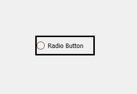
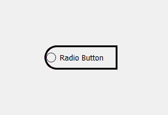
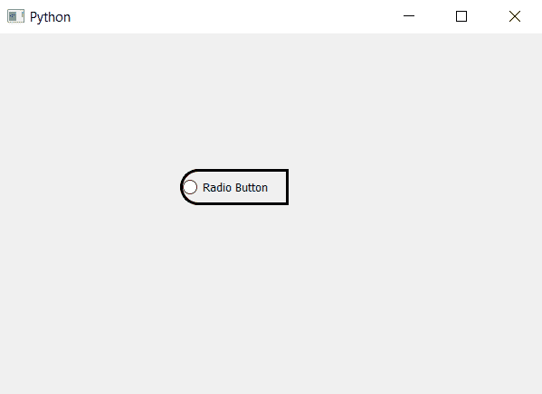

# PyQt5–管状单选按钮

> 原文:[https://www . geesforgeks . org/pyqt 5-管状-单选按钮/](https://www.geeksforgeeks.org/pyqt5-tube-shape-radio-button/)

在本文中，我们将看到如何创建一个管状单选按钮。默认情况下，单选按钮的形状是矩形。下面是普通边框单选按钮和管状单选按钮的图示。
 

> **为了做到这一点，我们必须做到以下几点:**
> 
> 1.创建单选按钮
> 2。设置宽度大于单选按钮
> 3 的高度。添加边框
> 4。将单选按钮左侧的半径设置为高度的一半。

**向单选按钮添加边框和半径的样式表代码–**

```
QRadioButton
{
border : 3px solid black;
border-top-left-radius : 20px;
border-bottom-left-radius : 20px;
}

```

下面是实现。

```
# importing libraries
from PyQt5.QtWidgets import * 
from PyQt5 import QtCore, QtGui
from PyQt5.QtGui import * 
from PyQt5.QtCore import * 
import sys

class Window(QMainWindow):

    def __init__(self):
        super().__init__()

        # setting title
        self.setWindowTitle("Python ")

        # setting geometry
        self.setGeometry(100, 100, 600, 400)

        # calling method
        self.UiComponents()

        # showing all the widgets
        self.show()

    # method for widgets
    def UiComponents(self):

        # creating a radio button
        self.radio_button = QRadioButton(self)

        # setting geometry of radio button
        self.radio_button.setGeometry(200, 150, 120, 40)

        # setting text to radio button
        self.radio_button.setText("Radio Button")

        # changing style sheet code of radio button
        # setting border to radio button and changing 
        # radius to half of height only to the left side
        self.radio_button.setStyleSheet("QRadioButton"
                                        "{"
                                        "border : 3px solid black;"
                                        "border-top-left-radius : 20px;"
                                        "border-bottom-left-radius : 20px;"
                                        "}")

# create pyqt5 app
App = QApplication(sys.argv)

# create the instance of our Window
window = Window()

# start the app
sys.exit(App.exec())
```

**输出:**
