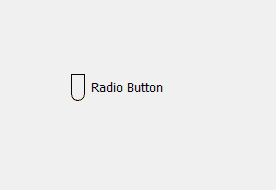
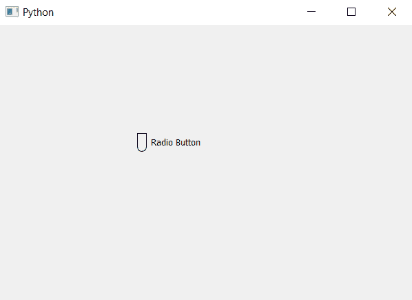

# PyQt5–单选按钮的管状指示器

> 原文:[https://www . geesforgeks . org/pyqt 5-管状单选按钮指示器/](https://www.geeksforgeeks.org/pyqt5-tube-shaped-indicator-of-radio-button/)

在本文中，我们将看到如何制作管状指示器的单选按钮。默认情况下，单选按钮指示器是圆形的。
下图是普通单选按钮和指示器为管状的单选按钮的示意图。

 

> **为了做到这一点我们必须做到以下几点:**
> 1。创建单选按钮。
> 2。设置边框，借助样式表将单选按钮指示器做成矩形(高度>宽度)。
> 3。将底部边框半径更改为指示器宽度和边框厚度的一半之和

**执行此操作的样式表代码–**

```
QRadioButton::indicator
{
border : 1px solid black;
width : 12;
height : 25;
border-bottom-left-radius : 7;
border-bottom-right-radius : 7;
}
```

下面是实现–

## 蟒蛇 3

```
# importing libraries
from PyQt5.QtWidgets import *
from PyQt5 import QtCore, QtGui
from PyQt5.QtGui import *
from PyQt5.QtCore import *
import sys

class Window(QMainWindow):

    def __init__(self):
        super().__init__()

        # setting title
        self.setWindowTitle("Python ")

        # setting geometry
        self.setGeometry(100, 100, 600, 400)

        # calling method
        self.UiComponents()

        # showing all the widgets
        self.show()

    # method for widgets
    def UiComponents(self):

        # creating a radio button
        self.radio_button = QRadioButton(self)

        # setting geometry of radio button
        self.radio_button.setGeometry(200, 150, 120, 40)

        # setting text to radio button
        self.radio_button.setText("Radio Button")

        # changing style sheet code of radio button setting border to
        # indicator of thickness 1px and of black color and width and height
        # and the border radius equal to thickness of border + half of height
        self.radio_button.setStyleSheet("QRadioButton::indicator"
                                        "{"
                                        "border : 1px solid black;"
                                        "width : 12px;"
                                        "height : 25px;"
                                        "border-bottom-left-radius : 7px;"
                                        "border-bottom-right-radius : 7px;"
                                        "}")

# create pyqt5 app
App = QApplication(sys.argv)

# create the instance of our Window
window = Window()

# start the app
sys.exit(App.exec())
```

**输出:**

