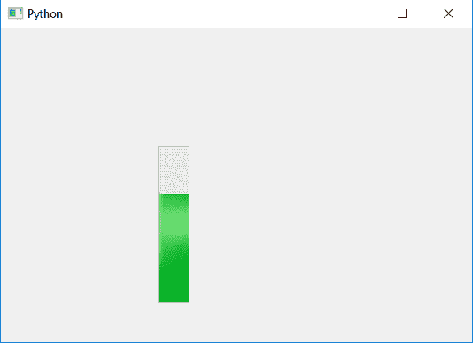

# PyQt5 |垂直进度条

> 原文:[https://www.geeksforgeeks.org/pyqt5-vertical-progress-bar/](https://www.geeksforgeeks.org/pyqt5-vertical-progress-bar/)

在本文中，我们将看到如何创建垂直进度条。当我们在默认情况下创建一个进度条时，它是水平的。为了进行垂直布局，我们必须改变进度条的方向。

为了改变进度条的方向，我们将使用`setOrientation`方法。

> **语法:** bar.setOrientation(QtCore。垂直方向)
> 
> **参数:**需要 Qt。定向对象
> 
> **执行的动作:**会改变进度条的方向。

**代码:**

```py
# importing libraries
from PyQt5.QtWidgets import * 
from PyQt5 import QtCore, QtGui
from PyQt5.QtGui import * 
from PyQt5.QtCore import * 
import sys

class Window(QMainWindow):

    def __init__(self):
        super().__init__()

        # setting title
        self.setWindowTitle("Python ")

        # setting geometry
        self.setGeometry(100, 100, 600, 400)

        # calling method
        self.UiComponents()

        # showing all the widgets
        self.show()

    # method for widgets
    def UiComponents(self):

        # creating progress bar
        bar = QProgressBar(self)

        # setting geometry to progress bar
        bar.setGeometry(200, 150, 40, 200)

        # set value to progress bar
        bar.setValue(70)

        # changing the orientation
        bar.setOrientation(QtCore.Qt.Vertical)

# create pyqt5 app
App = QApplication(sys.argv)

# create the instance of our Window
window = Window()

# start the app
sys.exit(App.exec())
```

**输出:**
