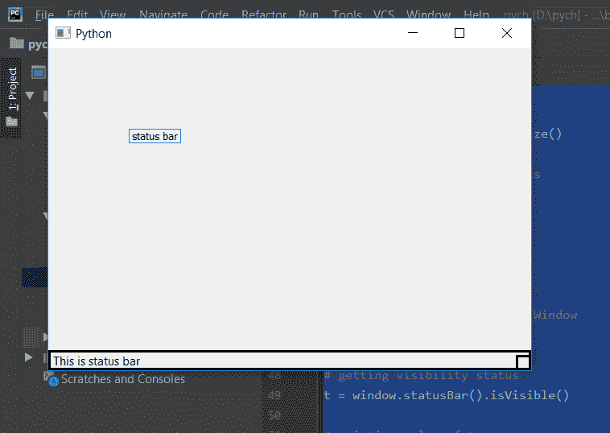

# PyQt5–状态栏的可见性状态

> 原文:[https://www . geesforgeks . org/pyqt 5-可见性-状态-状态栏/](https://www.geeksforgeeks.org/pyqt5-visibility-status-of-status-bar/)

状态栏的可见性状态可以被称为如果它是可见的，那么它将返回真，否则返回假。我们可以用`isVisible`的方法来检查。

> **语法:**class _ object . status _ bar _ object . isvisible()
> 
> **参数:**不取参数。
> 
> **返回:**返回 bool。

**注意#1:** 如果我们不创建状态栏的对象，这个属性将为假。
**注 2:** 如果在构造函数内部调用这个方法，它将总是返回 False，就像之前显示任何东西一样，每个可见的状态都是 False。

**代码:**

```py
from PyQt5.QtCore import * 
from PyQt5.QtGui import * 
from PyQt5.QtWidgets import * 
import sys

class Window(QMainWindow):
    def __init__(self):
        super().__init__()

        # set the title
        self.setWindowTitle("Python")

        # setting  the geometry of window
        self.setGeometry(60, 60, 600, 400)

        # setting status bar message
        self.statusBar().showMessage("This is status bar")

        # setting  border
        self.statusBar().setStyleSheet("border :3px solid black;")

        # setting tool tip for status bar
        self.statusBar().setToolTip("Hello ! from status bar")

        # creating a label widget
        self.label_1 = QLabel("status bar", self)

        # moving position
        self.label_1.move(100, 100)

        # setting up the border
        self.label_1.setStyleSheet("border :1px solid blue;")

        # resizing label
        self.label_1.adjustSize()

        # show all the widgets
        self.show()

# create pyqt5 app
App = QApplication(sys.argv)

# create the instance of our Window
window = Window()

# getting visibility status
t = window.statusBar().isVisible()

# printing value of t
print(t)

# start the app
sys.exit(App.exec())
```

**输出:**

```py
True
```

