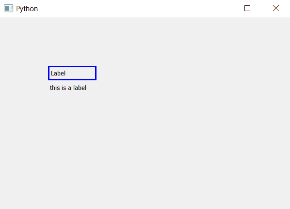

# PyQt5–Label | setwhatshis()方法的帮助文本是什么

> 原文:[https://www . geesforgeks . org/pyqt 5-what-this-help-text-for-label-setwhatshis-method/](https://www.geeksforgeeks.org/pyqt5-whats-this-help-text-for-label-setwhatsthis-method/)

在 PyQt5 中，有许多小部件，在制作应用程序时，我们最终会放入许多小部件。有时，我们可以记住为什么使用这个小部件，但并不总是这样，这似乎也不是一个好的做法。这就是为什么为了后端的目的，PyQt5 允许我们设置帮助文本。在本文中，我们将看到如何设置和访问标签的帮助文本。

要设置帮助文本，我们使用`setWhatsThis`方法–

> **语法:**label . setwhatshis(help _ text)
> T3】参数:它以字符串作为参数。
> **执行的动作:**设置帮助文本。

要访问帮助文本，我们使用`whatsThis()`方法–

> **句法:**label . what this()
> T3】论证:不需要论证。
> **返回:**返回字符串。

**代码:**

```py
# importing the required libraries

from PyQt5.QtCore import * 
from PyQt5.QtGui import * 
from PyQt5.QtWidgets import * 
import sys

class Window(QMainWindow):

    def __init__(self):
        super().__init__()

        # set the title
        self.setWindowTitle("Python")

        # setting  the geometry of window
        self.setGeometry(60, 60, 600, 400)

        # creating a label widget
        self.label_1 = QLabel("Label ", self)
        # moving position
        self.label_1.move(100, 100)

        # setting up the border
        self.label_1.setStyleSheet("border :3px solid blue;")

        help_text = "this is a label"

        # setting the information for a label
        self.label_1.setWhatsThis(help_text)

        # accessing the information
        whats_this = self.label_1.whatsThis()

        # creating a label widget to display whatsthis
        self.label_2 = QLabel(whats_this, self)

        # moving the label
        self.label_2.move(100, 130)

        # show all the widgets
        self.show()

# create pyqt5 app
App = QApplication(sys.argv)

# create the instance of our Window
window = Window()
# start the app
sys.exit(App.exec())
```

**输出:**
