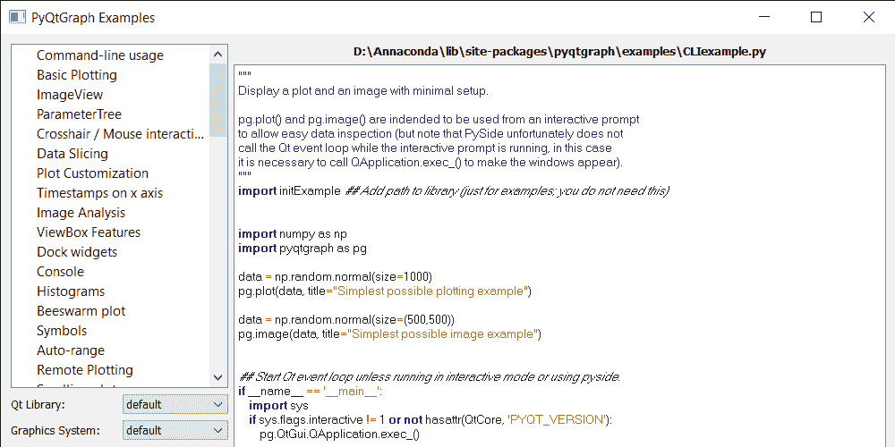
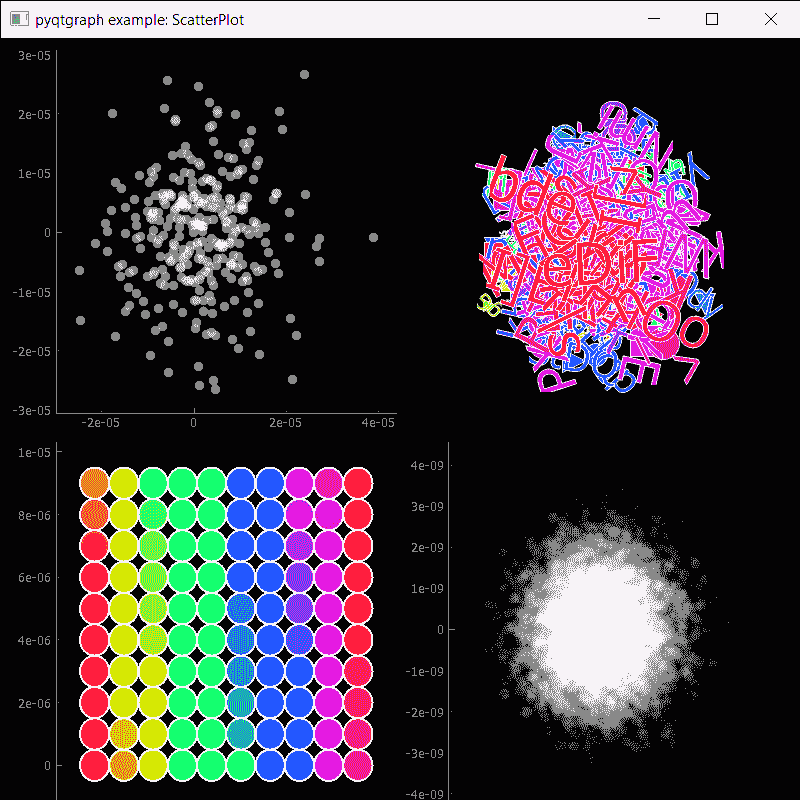

# PyQtGraph–大量示例

> 原文:[https://www.geeksforgeeks.org/pyqtgraph-extensive-examples/](https://www.geeksforgeeks.org/pyqtgraph-extensive-examples/)

在本文中，我们将看到如何访问 PyQtGraph 的大量示例。PyQtGraph 是 Python 的图形和用户界面库，提供设计和科学应用程序通常需要的功能。它的主要目标是为显示数据(图表、视频等)提供快速的交互式图形。)第二是提供工具来帮助快速应用程序开发(例如，属性树，如在 Qt Designer 中使用的属性树)。

PyQtGraph 包含一组可由`import pyqtgraph.examples`模块访问的大量示例

> 为了做到这一点，我们对 pyqtgraph 使用`run`方法
> 
> **语法:**示例。运行()
> 
> **论证:**不需要论证
> 
> **返回:**返回无

下面是实现

```py
# importing the pyqtgraph.examples module
import pyqtgraph.examples

# run this examples
pyqtgraph.examples.run()
```

**输出:**

当我们运行这段代码时，会出现一个有很多选项的窗口，在左边我们有基本的功能，在主屏幕上它显示了小部件/功能的代码和解释，在左下角我们可以选择尝试示例


现在让我们遍历左侧的字段，看看这个例子将如何工作

<video class="wp-video-shortcode" id="video-488566-1" width="665" height="333" preload="metadata" controls=""><source type="video/mp4" src="https://media.geeksforgeeks.org/wp-content/uploads/20200917012351/PyQtGraph-Examples-2020-09-17-01-23-20.mp4?_=1">[https://media.geeksforgeeks.org/wp-content/uploads/20200917012351/PyQtGraph-Examples-2020-09-17-01-23-20.mp4](https://media.geeksforgeeks.org/wp-content/uploads/20200917012351/PyQtGraph-Examples-2020-09-17-01-23-20.mp4)</video>
When we click on the scatterplot example, below is the new window which will appear to try


为了更好地理解 PyQtGraph 模块，我们可以随时尝试更多的例子