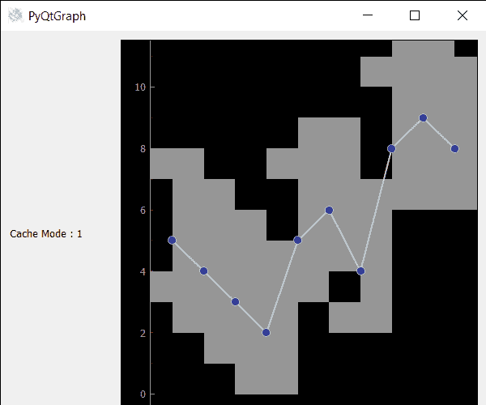

# PyQtGraph–获取误差条形图的 Chache 模式

> 原文:[https://www . geesforgeks . org/pyqtgraph-get-chache-mode-of-error-bar-graph/](https://www.geeksforgeeks.org/pyqtgraph-getting-chache-mode-of-error-bar-graph/)

在本文中，我们将看到如何在 PyQtGraph 模块中获得错误条形图的缓存模式。PyQtGraph 是 Python 的图形和用户界面库，提供设计和科学应用程序通常需要的功能。它的主要目标是为显示数据(图表、视频等)提供快速的交互式图形。).误差线是数据可变性的图形表示，用在图表上表示报告测量中的误差或不确定性。它们给出了测量精度的大致概念，或者相反，真实值可能与报告值有多远。误差线项目的位置基本上是从原点开始的数据的位置，默认为 0，0，尽管它可以随时改变。缓存用于通过分配和渲染到屏幕外像素缓冲区来加速渲染，当项目需要重绘时，可以重用该缓冲区。对于一些绘画设备，缓存直接存储在图形内存中，这使得渲染非常快。可以借助 setCacheMode 方法进行设置。

我们可以创建一个绘图窗口，并在下面给出的命令的帮助下在上面创建误差条形图

```
# creating a pyqtgraph plot window
plt = pg.plot()

# creating a error bar item object
error = pg.ErrorBarItem(x=x, y=y, top=top, bottom=bottom, beam=0.5)
```

> 为此，我们对错误栏项目对象
> **使用 cacheMode 方法语法:** error.cacheMode()
> **参数:**它不带参数
> **Return :** 它返回模式值

下面是实现

## 蟒蛇 3

```
# importing Qt widgets
from PyQt5.QtWidgets import *

# importing system
import sys

# importing numpy as np
import numpy as np

# importing pyqtgraph as pg
import pyqtgraph as pg
from PyQt5.QtGui import *
from PyQt5.QtCore import *

from collections import namedtuple

class Window(QMainWindow):

    def __init__(self):
        super().__init__()

        # setting title
        self.setWindowTitle("PyQtGraph")

        # setting geometry
        self.setGeometry(100, 100, 600, 500)

        # icon
        icon = QIcon("skin.png")

        # setting icon to the window
        self.setWindowIcon(icon)

        # calling method
        self.UiComponents()

        # showing all the widgets
        self.show()

    # method for components
    def UiComponents(self):

        # creating a widget object
        widget = QWidget()

        # creating a label
        label = QLabel("Geeksforgeeks Error Bar plot")

        # setting minimum width
        label.setMinimumWidth(130)

        # making label do word wrap
        label.setWordWrap(True)

        # setting configuration options
        pg.setConfigOptions(antialias=True)

        # creating x-axis values
        x = np.array([1, 2, 3, 4, 5, 6, 7, 8, 9, 10])

        # creating y-axis values
        y = np.array([5, 4, 3, 2, 5, 6, 4, 8, 9, 8])

        # creating upper bound values
        top = np.array([2, 2, 2, 2, 2, 2, 2, 2, 2, 2])

        # creating lower bound values
        bottom = np.array([2, 2, 2, 2, 2, 2, 2, 2, 2, 2])

        # creating a plot window
        plt = pg.plot()

        # creating a error bar item
        error = pg.ErrorBarItem(beam=0.5)

        # setting data to error bar item
        error.setData(x=x, y=y, top=top, bottom=bottom)

        # adding error bar item to the plot window
        plt.addItem(error)

        # plotting the data on plot window
        plt.plot(x, y, symbol='o', pen={'color': 0.8, 'width': 2})

        # Creating a grid layout
        layout = QGridLayout()

        # minimum width value of the label
        label.setMinimumWidth(130)

        # setting this layout to the widget
        widget.setLayout(layout)

        # adding label in the layout
        layout.addWidget(label, 1, 0)

        # plot window goes on right side, spanning 3 rows
        layout.addWidget(plt, 0, 1, 3, 1)

        # setting this widget as central widget of the main window
        self.setCentralWidget(widget)

        # setting cache mode of error bar item
        error.setCacheMode(1)

        # getting cache mode  of the error bar item
        value = error.cacheMode()

        # setting text to the label
        label.setText("Cache Mode : " + str(value))

# create pyqt5 app
App = QApplication(sys.argv)

# create the instance of our Window
window = Window()

# start the app
sys.exit(App.exec())
```

**输出:**

