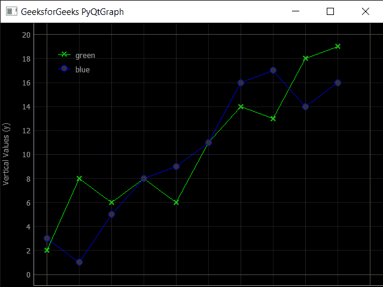

# PyQtGraph–绘图窗口

> 原文:[https://www.geeksforgeeks.org/pyqtgraph-plot-window/](https://www.geeksforgeeks.org/pyqtgraph-plot-window/)

在本文中，我们将看到如何在 PyQtGraph 模块中创建绘图窗口。PyQtGraph 是 Python 的图形和用户界面库，提供设计和科学应用程序通常需要的功能。它的主要目标是为显示数据(图表、视频等)提供快速的交互式图形。)第二是提供工具来帮助快速应用程序开发(例如，属性树，如在 Qt Designer 中使用的属性树)。
绘图窗口由两个主要部分组成:包含实际绘图图形的绘图面板(默认位于顶部)和控制面板(默认位于底部)。控制面板是您配置将要绘制的内容的地方。对于一个简单的散点图来说，它可能只是一个选择哪些列相互对照的情况，但是它可以变得非常详细。

> 为此，我们使用 pyqtgraph
> **语法的 plot 方法:** pg.plot()
> **参数:**它不需要参数
> **返回:**它返回 PlotWindow 对象

下面是实现

## 蟒蛇 3

```py
# importing pyqtgraph as pg
import pyqtgraph as pg

# importing QtCore and QtGui from the pyqtgraph module
from pyqtgraph.Qt import QtCore, QtGui

# importing numpy as np
import numpy as np

# define the data
title = "GeeksforGeeks PyQtGraph"

# y values to plot by line 1
y = [2, 8, 6, 8, 6, 11, 14, 13, 18, 19]

# y values to plot by line 2
y2 = [3, 1, 5, 8, 9, 11, 16, 17, 14, 16]
x = range(0, 10)

# create plot window object
plt = pg.plot()

# showing x and y grids
plt.showGrid(x = True, y = True)

# adding legend
plt.addLegend()

# set properties of the label for y axis
plt.setLabel('left', 'Vertical Values', units ='y')

# set properties of the label for x axis
plt.setLabel('bottom', 'Horizontal Values', units ='s')

# setting horizontal range
plt.setXRange(0, 10)

# setting vertical range
plt.setYRange(0, 20)

# setting window title
plt.setWindowTitle(title)

# ploting line in green color
line1 = plt.plot(x, y, pen ='g', symbol ='x', symbolPen ='g',
                           symbolBrush = 0.2, name ='green')

# ploting line2 with blue color
line2 = plt.plot(x, y2, pen ='b', symbol ='o', symbolPen ='b',
                             symbolBrush = 0.2, name ='blue')

# main method
if __name__ == '__main__':

    # importing system
    import sys

    # Start Qt event loop unless running in interactive mode or using
    if (sys.flags.interactive != 1) or not hasattr(QtCore, 'PYQT_VERSION'):
        QtGui.QApplication.instance().exec_()
```

**输出:**

