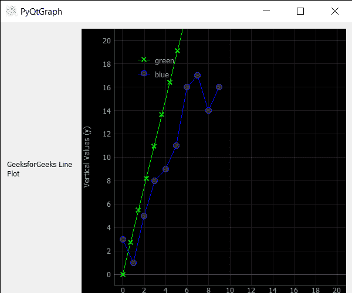

# PyQtGraph–在线形图中设置增加的线倾角

> 原文:[https://www . geeksforgeeks . org/pyqtgraph-设置-增加-线内倾角-图形/](https://www.geeksforgeeks.org/pyqtgraph-setting-increased-inclination-angle-of-line-in-line-graph/)

在本文中，我们将看到如何在 PyQtGraph 模块中增加折线图的倾斜角度。PyQtGraph 是 Python 的图形和用户界面库，提供设计和科学应用程序通常需要的功能。它的主要目标是为显示数据(图表、视频等)提供快速的交互式图形。)折线图或线图或折线图或曲线图是一种图表类型，它将信息显示为一系列由直线段连接的数据点，称为“标记”。它是许多领域中常见的一种基本图表类型。线图是借助 PyQtGraph 中的绘图类创建的。倾斜角是直线与原点相交时形成的角度
我们可以创建一个绘图窗口，并在下面给出的命令的帮助下在其上创建直线

```py
# creating a pyqtgraph plot window
plt = pg.plot()

# ploting line in green color
# with dot symbol as x, not a mandatory field
line = plt.plot(x, y, pen='g', symbol='x', symbolPen='g',
                symbolBrush=0.2, name='green')
```

> 为此，我们对行对象
> **使用 setRotation 方法语法:** line.setRotation(n)
> **参数:**它以浮点值作为参数
> **返回:**它返回 None

下面是实现

## 蟒蛇 3

```py
# importing Qt widgets
from PyQt5.QtWidgets import *
import sys

# importing pyqtgraph as pg
import pyqtgraph as pg
from PyQt5.QtGui import *

# Bar Graph class
class BarGraphItem(pg.BarGraphItem):

    # constructor which inherit original
    # BarGraphItem
    def __init__(self, *args, **kwargs):
        pg.BarGraphItem.__init__(self, *args, **kwargs)

    # creating a mouse double click event
    def mouseDoubleClickEvent(self, e):

        # setting scale
        self.setScale(0.2)

class Window(QMainWindow):

    def __init__(self):
        super().__init__()

        # setting title
        self.setWindowTitle("PyQtGraph")

        # setting geometry
        self.setGeometry(100, 100, 600, 500)

        # icon
        icon = QIcon("skin.png")

        # setting icon to the window
        self.setWindowIcon(icon)

        # calling method
        self.UiComponents()

        # showing all the widgets
        self.show()

    # method for components
    def UiComponents(self):

        # creating a widget object
        widget = QWidget()

        # creating a new label
        label = QLabel("GeeksforGeeks Line Plot")

        # making it multiline
        label.setWordWrap(True)

        # y values to plot by line 1
        y = [0, 1, 2, 3, 4, 5, 6, 7, 8, 9]

        # y values to plot by line 2
        y2 = [3, 1, 5, 8, 9, 11, 16, 17, 14, 16]
        x = range(0, 10)

        # create plot window object
        plt = pg.plot()

        # showing x and y grids
        plt.showGrid(x=True, y=True)

        # adding legend
        plt.addLegend()

        # set properties of the label for y axis
        plt.setLabel('left', 'Vertical Values', units='y')

        # set properties of the label for x axis
        plt.setLabel('bottom', 'Horizontal Vlaues', units='s')

        # setting horizontal range
        plt.setXRange(0, 20)

        # setting vertical range
        plt.setYRange(0, 20)

        # ploting line in green color
        # with dot symbol as x, not a mandatory field
        line1 = plt.plot(x, y, pen='g', symbol='x',
                         symbolPen='g', symbolBrush=0.2, name='green')

        # ploting line2 with blue color
        # with dot symbol as o
        line2 = plt.plot(x, y2, pen='b', symbol='o',
                         symbolPen='b', symbolBrush=0.2, name='blue')

        # setting scale of line 1
        line1.setScale(2)

        # increasing inclination angle of line 1
        value = line1.setRotation(30)

        # label minimum width
        label.setMinimumWidth(120)

        # Creating a grid layout
        layout = QGridLayout()

        # setting this layout to the widget
        widget.setLayout(layout)

        # adding label to the layout
        layout.addWidget(label, 1, 0)

        # plot window goes on right side, spanning 3 rows
        layout.addWidget(plt, 0, 1, 3, 1)

        # setting this widget as central widget of the main window
        self.setCentralWidget(widget)

# create pyqt5 app
App = QApplication(sys.argv)

# create the instance of our Window
window = Window()

# start the app
sys.exit(App.exec())
```

**输出:**

