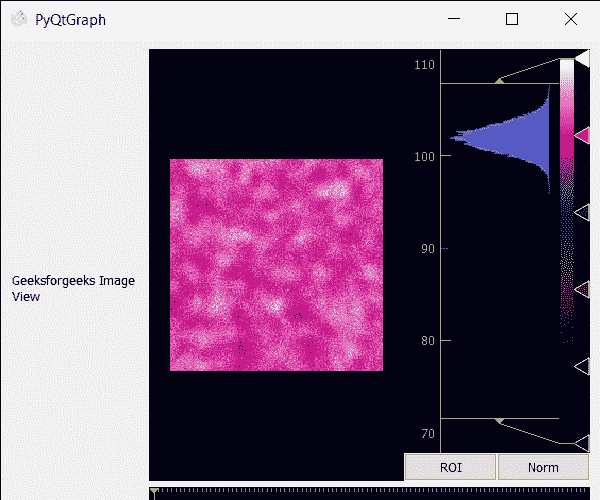

# PyQtGraph–设置图像视图名称

> 原文:[https://www . geesforgeks . org/pyqtgraph-setting-name-of-image-view/](https://www.geeksforgeeks.org/pyqtgraph-setting-name-of-image-view/)

在本文中，我们将看到如何在 PyQTGraph 中设置图像视图对象的名称。PyQtGraph 是 Python 的图形和用户界面库，提供设计和科学应用程序通常需要的功能。它的主要目标是为显示数据(图表、视频等)提供快速的交互式图形。).用于显示和分析图像数据的小部件。实现许多功能，如显示 2D 和三维图像数据。对于 3D 数据，显示 z 轴滑块，允许用户选择显示哪个帧。显示图像数据的直方图，可移动区域定义暗/亮级别，可编辑渐变提供颜色查找表。name 属性用于将图像视图与其他对象区分开来，借助 name 属性，可以轻松搜索该图像视图。
我们可以借助下面给出的命令创建一个图像视图

```
# creating a pyqtgraph image view object
imv = pg.ImageView()
```

> **语法:** ImageView(parent=None，name='ImageView '，view=None，imageItem=None，levelmode= ' mono '，*args)
> 
> **参数:**
> 
> *   **父代** **(QWidget):** 指定此 ImageView 将属于的父代 Widget。如果没有，则创建没有父级的图像视图。
> *   **名称(字符串):**用于注册内部视图框和用于显示感兴趣区域数据的绘图项目的名称。
> *   **视图(视图框或绘图项目):**如果指定，这将用作包含显示图像的显示区域。
> *   **imageItem (ImageItem):** 如果指定，该对象将用于显示图像。必须是 ImageItem 或其他兼容对象的实例。
> *   **等级模式:**指定*等级模式*参数
> 
> **返回:【ImageView 类的对象**

为此，我们对图像视图对象使用 **setAccessibleName()** 方法

> **语法:**imv . setaccessiblename(name)
> **参数:**它以字符串作为参数
> **返回:**它返回 None

下面是实现

## 蟒蛇 3

```
# importing Qt widgets
from PyQt5.QtWidgets import *

# importing system
import sys

# importing numpy as np
import numpy as np

# importing pyqtgraph as pg
import pyqtgraph as pg
from PyQt5.QtGui import *
from PyQt5.QtCore import *

# Image View class
class ImageView(pg.ImageView):

    # constructor which inherit original
    # ImageView
    def __init__(self, *args, **kwargs):
        pg.ImageView.__init__(self, *args, **kwargs)

class Window(QMainWindow):

    def __init__(self):
        super().__init__()

        # setting title
        self.setWindowTitle("PyQtGraph")

        # setting geometry
        self.setGeometry(100, 100, 600, 500)

        # icon
        icon = QIcon("skin.png")

        # setting icon to the window
        self.setWindowIcon(icon)

        # calling method
        self.UiComponents()

        # showing all the widgets
        self.show()

    # method for components
    def UiComponents(self):

        # creating a widget object
        widget = QWidget()

        # creating a label
        label = QLabel("Geeksforgeeks Image View")

        # setting minimum width
        label.setMinimumWidth(130)

        # making label do word wrap
        label.setWordWrap(True)

        # setting configuration options
        pg.setConfigOptions(antialias = True)

        # creating image view view object
        imv = ImageView()

        # Create random 3D data set with noisy signals
        img = pg.gaussianFilter(np.random.normal(size = (200, 200)), (5, 5)) * 20 + 100

        # setting new axis to image
        img = img[np.newaxis, :, :]

        # decay data
        decay = np.exp(-np.linspace(0, 0.3, 100))[:, np.newaxis, np.newaxis]

        # random data
        data = np.random.normal(size = (100, 200, 200))
        data += img * decay
        data += 2

        # adding time-varying signal
        sig = np.zeros(data.shape[0])
        sig[30:] += np.exp(-np.linspace(1, 10, 70))
        sig[40:] += np.exp(-np.linspace(1, 10, 60))
        sig[70:] += np.exp(-np.linspace(1, 10, 30))

        sig = sig[:, np.newaxis, np.newaxis] * 3
        data[:, 50:60, 30:40] += sig

        # setting image to image view
        # Displaying the data and assign each frame a time value from 1.0 to 3.0
        imv.setImage(data, xvals=np.linspace(1., 3., data.shape[0]))

        ## Set a custom color map
        colors = [
            (0, 0, 0),
            (4, 5, 61),
            (84, 42, 55),
            (15, 87, 60),
            (208, 17, 141),
            (255, 255, 255)
        ]

        # color map
        cmap = pg.ColorMap(pos=np.linspace(0.0, 1.0, 6), color = colors)

        # setting color map to the image view
        imv.setColorMap(cmap)

        # Creating a grid layout
        layout = QGridLayout()

        # minimum width value of the label
        label.setFixedWidth(130)

        # setting this layout to the widget
        widget.setLayout(layout)

        # adding label in the layout
        layout.addWidget(label, 1, 0)

        # plot window goes on right side, spanning 3 rows
        layout.addWidget(imv, 0, 1, 3, 1)

        # setting this widget as central widget of the main window
        self.setCentralWidget(widget)

        # setting name to image view
        imv.setAccessibleName("GfG Image View")

# create pyqt5 app
App = QApplication(sys.argv)

# create the instance of our Window
window = Window()

# start the app
sys.exit(App.exec())
```

**输出:**

