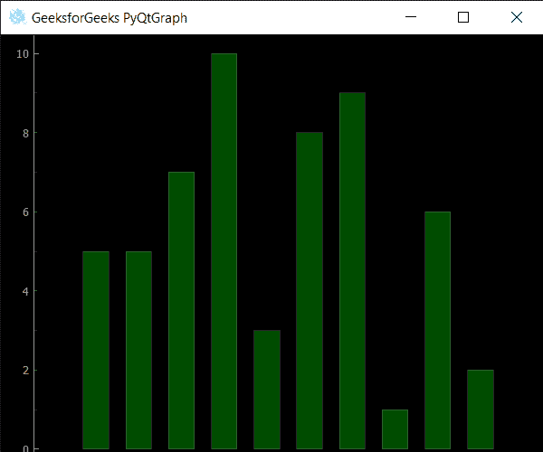

# PyQtGraph–设置条形图的不透明度

> 原文:[https://www . geeksforgeeks . org/pyqtgraph-设置-不透明度-条形图级别/](https://www.geeksforgeeks.org/pyqtgraph-setting-opacity-level-of-bar-graph/)

在本文中，我们将看到如何在 PyQtGraph 模块中设置条形图的不透明度。PyQtGraph 是 Python 的图形和用户界面库，提供设计和科学应用程序通常需要的功能。它的主要目标是为显示数据(图表、视频等)提供快速的交互式图形。)第二是提供工具来帮助快速应用程序开发(例如，属性树，如在 Qt Designer 中使用的属性树)。条形图或条形图是用矩形条表示分类数据的图表，矩形条的高度或长度与它们所代表的值成比例。条形图可以垂直或水平绘制。垂直条形图有时也称为柱形图。不透明度是对电磁或其他类型辐射，尤其是可见光不可透过性的度量。在辐射传输中，它描述了辐射在介质中的吸收和散射，如等离子体、电介质、屏蔽材料、玻璃等。

借助下面给出的命令，我们可以创建一个绘图窗口和条形图

```
# creating a pyqtgraph plot window
window = pg.plot()

# creating a bar graph of green color
bargraph = pg.BarGraphItem(x=x, height=y1, width=0.6, brush='g')

```

> 为此，我们对条形图对象使用`setOpacity`方法
> 
> **语法:**柱状图.设置容量(n)
> 
> **自变量:**以浮点值为自变量
> 
> **返回:**返回无

下面是实现

```
# importing QtGui to use QIcon
from PyQt5.QtGui import * from PyQt5.QtCore import Qt 

# importing pyqtgraph as pg
import pyqtgraph as pg

# importing QtCore and QtGui from the pyqtgraph module
from pyqtgraph.Qt import QtCore, QtGui

# importing numpy as np
import numpy as np

import time

# creating a pyqtgraph plot window
window = pg.plot()

# icon for plot window
icon = QIcon("logo.png")

# setting icon to the plot window
window.setWindowIcon(icon)

# setting window geometry
# left = 100, top = 100
# width = 600, height = 500
window.setGeometry(100, 100, 600, 500)

# title for the plot window
title = "GeeksforGeeks PyQtGraph"

# setting window title to plot window
window.setWindowTitle(title)

# create list for y-axis
y1 = [5, 5, 7, 10, 3, 8, 9, 1, 6, 2]

# create horizontal list i.e x-axis
x = [1, 2, 3, 4, 5, 6, 7, 8, 9, 10]

# create pyqt5graph bar graph item 
# with width = 0.6
# with bar colors = green
bargraph = pg.BarGraphItem(x = x, height = y1, width = 0.6, brush ='g')

# add item to plot window
# adding bargraph item to the window
window.addItem(bargraph)

# setting opacity level of the bargraph
bargraph.setOpacity(0.3)

# main method
if __name__ == '__main__':

    # importing system
    import sys

    # Start Qt event loop unless running in interactive mode or using 
    if (sys.flags.interactive != 1) or not hasattr(QtCore, 'PYQT_VERSION'):
        QtGui.QApplication.instance().exec_()

```

**输出:**
