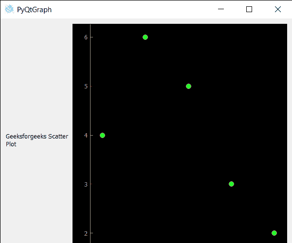

# PyQtGraph–散点图的设定点

> 原文:[https://www . geeksforgeeks . org/pyqtgraph-设置-散点图-图表/](https://www.geeksforgeeks.org/pyqtgraph-setting-points-of-scatter-plot-graph/)

在本文中，我们将看到如何在 PyQtGraph 模块中设置散点图的点。PyQtGraph 是 Python 的图形和用户界面库，提供设计和科学应用程序通常需要的功能。它的主要目标是为显示数据(图表、视频等)提供快速的交互式图形。).散点图(又称散点图，散点图)使用点来表示两个不同数值变量的值。这是一种使用笛卡尔坐标来显示一组数据的两个变量的值的绘图或数学图表。水平轴和垂直轴上每个点的位置表示单个数据点的值。点基本上是可以随时设置的点。

借助下面给出的命令，我们可以创建一个绘图窗口，并在其上创建散点图。

```py
# creating a pyqtgraph plot window
plt = pg.plot()

# creating a scatter plot graph of size = 10
scatter = pg.ScatterPlotItem(size=10)
```

> 为此，我们对散点图对象
> **使用了 setPoints 方法语法:**散点(x，y)
> **参数:**它将两个列表作为参数
> **返回:**它返回 None

下面是实现。

## 蟒蛇 3

```py
# importing Qt widgets
from PyQt5.QtWidgets import *

# importing system
import sys

# importing numpy as np
import numpy as np

# importing pyqtgraph as pg
import pyqtgraph as pg
from PyQt5.QtGui import *
from PyQt5.QtCore import *

class Window(QMainWindow):

    def __init__(self):
        super().__init__()

        # setting title
        self.setWindowTitle("PyQtGraph")

        # setting geometry
        self.setGeometry(100, 100, 600, 500)

        # icon
        icon = QIcon("skin.png")

        # setting icon to the window
        self.setWindowIcon(icon)

        # calling method
        self.UiComponents()

        # showing all the widgets
        self.show()

    # method for components
    def UiComponents(self):

        # creating a widget object
        widget = QWidget()

        # creating a label
        label = QLabel("Geeksforgeeks Scatter Plot")

        # making label do word wrap
        label.setWordWrap(True)

        # creating a plot window
        plot = pg.plot()

        # number of points
        n = 300

        # creating a scatter plot item
        # of size = 10
        # using brush to enlarge the of green color
        scatter = pg.ScatterPlotItem(
            size=10, brush=pg.mkBrush(30, 255, 35, 255))

        # data for x-axis
        x_data = [1, 2, 3, 4, 5, 6, 7, 8, 9, 10]

        # data for y-axis
        y_data = [5, 4, 6, 4, 3, 5, 6, 6, 7, 8]

        # setting data to the scatter plot
        scatter.setData(x_data, y_data)

        # add item to plot window
        # adding scatter plot item to the plot window
        plot.addItem(scatter)

        # Creating a grid layout
        layout = QGridLayout()

        # minimum width value of the label
        label.setMinimumWidth(130)

        # setting this layout to the widget
        widget.setLayout(layout)

        # adding label in the layout
        layout.addWidget(label, 1, 0)

        # plot window goes on right side, spanning 3 rows
        layout.addWidget(plot, 0, 1, 3, 1)

        # setting this widget as central widget of the main window
        self.setCentralWidget(widget)

        # setting points
        scatter.setPoints([1, 2, 3, 4, 5], [4, 6, 5, 3, 2])

# create pyqt5 app
App = QApplication(sys.argv)

# create the instance of our Window
window = Window()

# start the app
sys.exit(App.exec())
```

**输出:**

