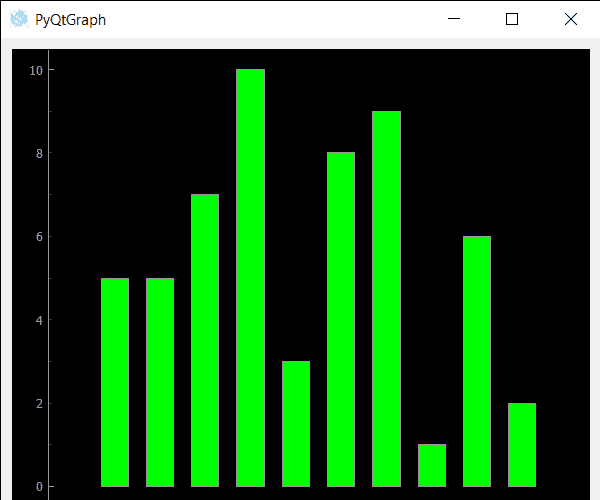

# PyQtGraph–查看条形图的变换变化事件

> 原文:[https://www . geeksforgeeks . org/pyqtgraph-view-transform-change-event-for-bar-graph/](https://www.geeksforgeeks.org/pyqtgraph-view-transform-change-event-for-bar-graph/)

在本文中，我们将看到如何使用 PyQtGraph 模块中的条形图创建视图转换更改事件。PyQtGraph 是 Python 的图形和用户界面库，提供设计和科学应用程序通常需要的功能。它的主要目标是为显示数据(图表、视频等)提供快速的交互式图形。)第二是提供工具来帮助快速应用程序开发(例如，属性树，如在 Qt Designer 中使用的属性树)。条形图或条形图是用矩形条表示分类数据的图表，矩形条的高度或长度与它们所代表的值成比例。条形图可以垂直或水平绘制。垂直条形图有时也称为柱形图。当条形图的视图转换发生更改时，会触发此事件。当通过拖动改变条形图的视图时，会发生此事件。
我们可以借助下面给出的命令创建一个绘图窗口和条形图

```
# creating a pyqtgraph plot window
window = pg.plot()

# creating a bar graph of green color
bargraph = pg.BarGraphItem(x=x, height=y1, width=0.6, brush='g')
```

为了做到这一点，我们修改了条形图类，下面是可以使用的类

```
# Bar Graph class
class BarGraphItem(pg.BarGraphItem):

    # constructor which inherit original 
    # BarGraphItem
    def __init__(self, *args, **kwargs):
        pg.BarGraphItem.__init__(self, *args, **kwargs)

    # creating view transform changed event
    def viewTransformChanged(self):

        # print the message
        print("View Transformed Changed")
```

下面是实现

## 蟒蛇 3

```
# importing Qt widgets
from PyQt5.QtWidgets import * import sys

# importing pyqtgraph as pg
import pyqtgraph as pg
from PyQt5.QtGui import *

# Bar Graph class
class BarGraphItem(pg.BarGraphItem):

    # constructor which inherit original
    # BarGraphItem
    def __init__(self, *args, **kwargs):
        pg.BarGraphItem.__init__(self, *args, **kwargs)

    # creating view transform changed event
    def viewTransformChanged(self):

        # print the message
        print("View Transformed Changed")

class Window(QMainWindow):

    def __init__(self):
        super().__init__()

        # setting title
        self.setWindowTitle("PyQtGraph")

        # setting geometry
        self.setGeometry(100, 100, 600, 500)

        # icon
        icon = QIcon("skin.png")

        # setting icon to the window
        self.setWindowIcon(icon)

        # calling method
        self.UiComponents()

        # showing all the widgets
        self.show()

    # method for components
    def UiComponents(self):

        # creating a widget object
        widget = QWidget()

        # creating a plot window
        plot = pg.plot()

        # create list for y-axis
        y1 = [5, 5, 7, 10, 3, 8, 9, 1, 6, 2]

        # create horizontal list i.e x-axis
        x = [1, 2, 3, 4, 5, 6, 7, 8, 9, 10]

        # create pyqt5graph bar graph item
        # with width = 0.6
        # with bar colors = green
        bargraph = BarGraphItem(x = x, height = y1, width = 0.6, brush ='g')

        # bargraph.viewRangeChanged.connect(lambda: print("sss"))
        # add item to plot window
        # adding bargraph item to the plot window
        plot.addItem(bargraph)

        # Creating a grid layout
        layout = QGridLayout()

        # setting this layout to the widget
        widget.setLayout(layout)

        # plot window goes on right side, spanning 3 rows
        layout.addWidget(plot, 0, 1, 3, 1)

        # setting this widget as central widget of the main window
        self.setCentralWidget(widget)

# create pyqt5 app
App = QApplication(sys.argv)

# create the instance of our Window
window = Window()

# start the app
sys.exit(App.exec())
```

**输出:**



```
View Transformed Changed
View Transformed Changed
View Transformed Changed
View Transformed Changed
View Transformed Changed
View Transformed Changed
View Transformed Changed
View Transformed Changed
View Transformed Changed
```