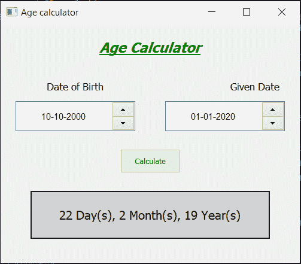

# Python–使用 PyQt 的年龄计算器

> 原文:[https://www . geeksforgeeks . org/python-age-calculator-using-pyqt/](https://www.geeksforgeeks.org/python-age-calculator-using-pyqt/)

在本文中，我们将看到如何使用 PyQt5 创建一个年龄计算器。

**PyQt5** 是跨平台的 GUI 工具包，一套针对 Qt v5 的 python 绑定。由于该库提供的工具和简单性，人们可以非常容易地开发交互式桌面应用程序。必须使用下面给出的命令进行安装

```
pip install PyQt5
```

下面是年龄计算器的样子


> **GUI 实现步骤:**
> 1。为游戏标题创建标题标签，设置其属性
> 2。创建一个出生日期标签，在这个标签下面创建一个日期编辑对象来接收日期并设置它们的属性
> 3。创建一个给定的日期标签，在这个标签下面创建 QDateEdit 对象来接收新的日期并设置它们的属性
> 4。创建一个按钮，当按下该按钮时，计算日期
> 5。创建结果标签以显示结果，即计算的年龄
> 
> **后端实现步骤:**
> 1。更改日期时，在第一个 QDateEdit 中添加操作
> 2。在第一次日期编辑操作中，获取第二次日期编辑的日期，并将该日期设置为第一次日期编辑的最大日期
> 3。更改日期时，在第二次日期编辑中添加操作
> 4。在第二次日期编辑操作中，获取第一次日期编辑的日期，并将该日期设置为第二次日期编辑的最小日期
> 5。设置不同的日期编辑，使第一个日期应小于第二个日期
> 6。向按钮
> 7 添加动作。在按钮操作中，从日期编辑中获取日期，计算差异，并在结果标签的帮助下将差异显示在屏幕上

下面是实现

```
# importing libraries
from PyQt5.QtWidgets import * 
from PyQt5 import QtCore, QtGui
from PyQt5.QtGui import * 
from PyQt5.QtCore import * 
import sys

class Window(QMainWindow):

    def __init__(self):
        super().__init__()

        # setting title
        self.setWindowTitle("Age calculator")

        # setting geometry
        self.setGeometry(100, 100, 500, 400)

        # calling method
        self.UiComponents()

        # showing all the widgets
        self.show()

    # method for components
    def UiComponents(self):

        # creating head label
        head = QLabel("Age Calculator", self)

        # setting geometry to the head
        head.setGeometry(100, 10, 300, 60)

        # font
        font = QFont('Times', 14)
        font.setBold(True)
        font.setItalic(True)
        font.setUnderline(True)

        # setting font to the head
        head.setFont(font)

        # setting alignment of the head
        head.setAlignment(Qt.AlignCenter)
        head.setStyleSheet("color : green;")

        # D.O.B label
        dob = QLabel("Date of Birth", self)

        # setting geometry
        dob.setGeometry(0, 80, 250, 50)

        # setting alignment and font
        dob.setAlignment(Qt.AlignCenter)
        dob.setFont(QFont('Times', 10))

        # given date label
        given = QLabel("Given Date", self)

        # setting geometry
        given.setGeometry(300, 80, 250, 50)

        # setting alignment and font
        given.setAlignment(Qt.AlignCenter)
        given.setFont(QFont('Times', 10))

        # creating a QDateEdit to get the d.o.b
        self.first = QDateEdit(self)

        # setting geometry
        self.first.setGeometry(25, 130, 200, 50)

        # setting font and alignment
        self.first.setAlignment(Qt.AlignCenter)
        self.first.setFont(QFont('Arial', 9))

        # adding action to the first
        # when date get change
        self.first.dateChanged.connect(self.first_action)

        # creating a QDateEdit to get the given date
        self.second = QDateEdit(self)

        # setting geometry
        self.second.setGeometry(275, 130, 200, 50)

        # setting font and alignment
        self.second.setAlignment(Qt.AlignCenter)
        self.second.setFont(QFont('Arial', 9))

        # adding action to the second
        # when date get change
        self.second.dateChanged.connect(self.second_action)

        # create a push button for calculate
        calculate = QPushButton("Calculate", self)

        # setting geometry to the push button
        calculate.setGeometry(200, 210, 100, 40)

        # setting color effect to the push button
        color = QGraphicsColorizeEffect()
        color.setColor(Qt.darkGreen)
        calculate.setGraphicsEffect(color)

        # adding action to the calculate button
        calculate.clicked.connect(self.find_age)

        # creating a result label to show the ans
        self.result = QLabel(self)

        # setting geometry
        self.result.setGeometry(50, 280, 400, 80)

        # setting style sheet and the font
        self.result.setAlignment(Qt.AlignCenter)
        self.result.setFont(QFont('Times', 12))

        # setting stylesheet
        self.result.setStyleSheet("QLabel"
                                  "{"
                                  "border : 2px solid black;"
                                  "background : lightgrey;"
                                  "}")

        # making label multi line
        self.result.setWordWrap(True)

        # set dates to the first and second
        self.first.setDate(QDate(2000, 1, 1))
        self.second.setDate(QDate(2020, 1, 1))

    # method called by the first date edit
    def first_action(self):

        # get the second date
        date = self.second.date()

        # set the maximum date in first
        self.first.setMaximumDate(date)

    # method called by the first date edit
    def second_action(self):

        # get the first date
        date = self.first.date()

        # set the maximum date in first
        self.second.setMinimumDate(date)

    # method called by the push button
    def find_age(self):

        # get the first age
        get_Qdate1 = self.first.date()
        birth_year = get_Qdate1.year()
        birth_month = get_Qdate1.month()
        birth_day = get_Qdate1.day()

        # get the second age
        get_Qdate2 = self.second.date()
        given_year = get_Qdate2.year()
        given_month = get_Qdate2.month()
        given_day = get_Qdate2.day()

        # if birth date is greater then given birth_month
        # then donot count this month and add 30 to the date so
        # as to subtract the date and get the remaining days
        month = [31, 28, 31, 30, 31, 30, 31, 31, 30, 31, 30, 31]

        if (birth_day > given_day):
            given_month = given_month - 1
            given_day = given_day + month[birth_month - 1]

        # if birth month exceeds given month, then
        # donot count this year and add 12 to the
        # month so that we can subtract and find out
        # the difference
        if (birth_month > given_month):
            given_year = given_year - 1
            given_month = given_month + 12

        # calculate day, month, year
        calculated_day = given_day - birth_day
        calculated_month = given_month - birth_month
        calculated_year = given_year - birth_year

        # setting text to the result
        self.result.setText(str(calculated_day) + " Day(s), " + str(calculated_month)
                            + " Month(s), " + str(calculated_year) + " Year(s)")

    # create pyqt5 app
App = QApplication(sys.argv)

# create the instance of our Window
window = Window()

# start the app
sys.exit(App.exec())
```

**输出:**

<video class="wp-video-shortcode" id="video-427475-1" width="640" height="512" preload="metadata" controls=""><source type="video/mp4" src="https://media.geeksforgeeks.org/wp-content/uploads/20200608055524/Age-calculator-2020-06-08-05-54-46.mp4?_=1">[https://media.geeksforgeeks.org/wp-content/uploads/20200608055524/Age-calculator-2020-06-08-05-54-46.mp4](https://media.geeksforgeeks.org/wp-content/uploads/20200608055524/Age-calculator-2020-06-08-05-54-46.mp4)</video>